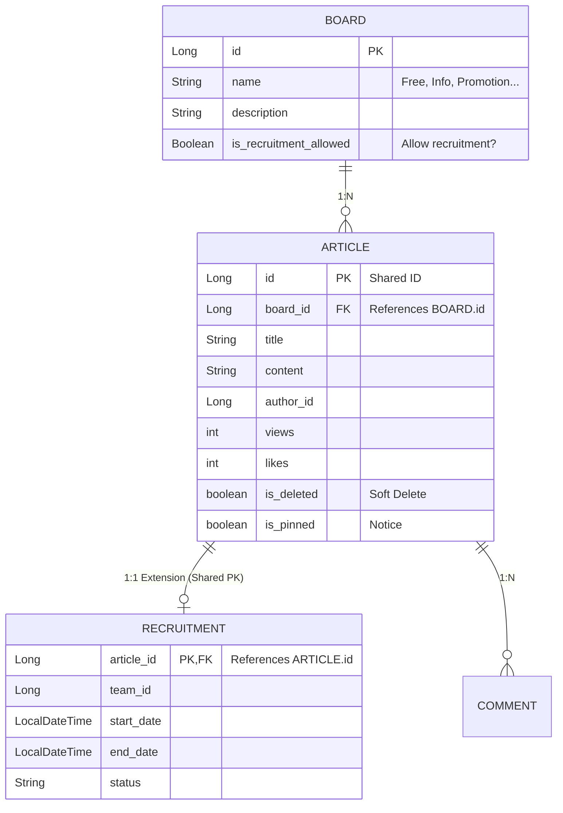

# KOSP System Architecture

## 1. Overview
This document outlines the architectural decisions, domain structure, and security mechanisms of the KOSP project.

---

## 2. Domain Structure (Community & Board)

### 2.1 Concept
To support extensibility without code changes, KOSP uses a **Board-based** structure instead of hardcoded Enums for categories.

### 2.2 Entity Relationships (ERD)



### 2.3 Key Components
*   **Board**: Metadata for categorization. Admins can create new boards dynamically.
*   **Article**: Base entity for all posts. Uses `board_id`.
*   **Recruitment**: Extension of Article for team recruiting. Available only if `Board.is_recruitment_allowed` is true.

---

## 3. Authorization System (RBAC + @Permit)

### 3.1 Overview
Combines **Redis Pub/Sub** for real-time updates and **AOP** for zero-overhead runtime checks.

### 3.2 Architecture
```mermaid
sequenceDiagram
    participant Client
    participant Controller
    participant Aspect (@Permit)
    participant SecurityContext
    
    Client->>Controller: API Request
    Controller->>Aspect: Intercept (@Permit)
    
    alt permitAll = true
        Aspect->>Controller: Pass
    else permitAll = false
        Aspect->>SecurityContext: Check Authentication
        
        opt Not Authenticated
            Aspect-->>Client: 401 Unauthorized
        end
        
        alt name is empty
            Aspect->>Controller: Pass (Auth only)
        else specific permission required
            Aspect->>PermissionService: hasPermission(user, "name")
            
            alt Has Permission
                Aspect->>Controller: Pass
            else No Permission
                Aspect-->>Client: 403 Forbidden
            end
        end
    end
```

### 3.3 Security Components
1.  **`@Permit`**: Annotate controllers to define security rules.
    *   `permitAll = true`: Public access.
    *   `name = "domain:action"`: Requires specific permission (RBAC).
2.  **`PermissionAspect`**: Runtime AOP guard using `SecurityContextHolder`.
3.  **`PermissionService`**: Transactional service to traverse `User -> Role -> Policy -> Permission`.
4.  **`PermissionInitializer`**: Auto-registers permissions defined in code to DB on startup (preserves existing policies).
