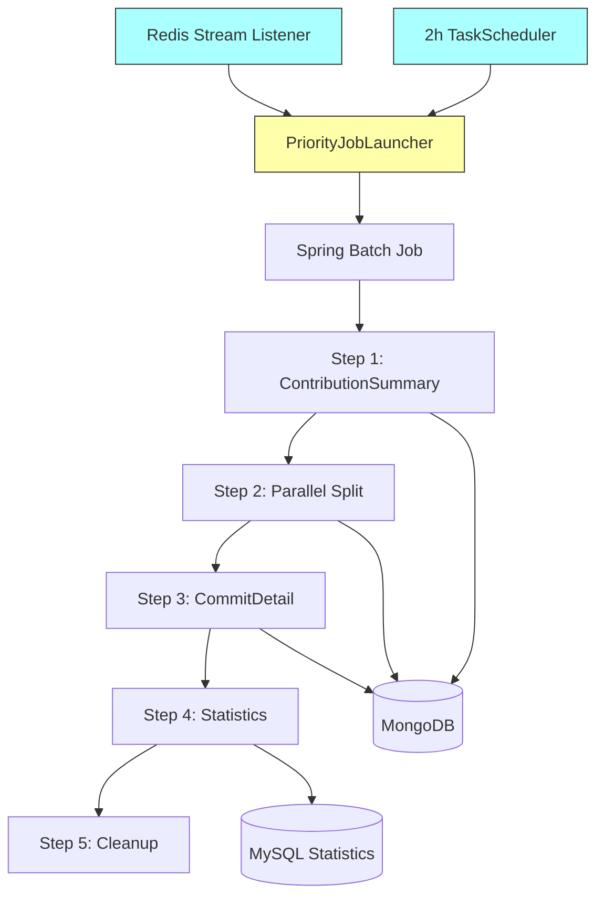

# GitHub 데이터 수집 프로세스 및 로직 (KOSP-Github-Harvester)

이 문서는 KOSP의 GitHub 데이터 수집 시스템의 동작 흐름과 로직을 중심으로 기술합니다.

> **Note**: 이 프로젝트는 KOSP-Backend에서 분리된 독립 서비스입니다.

---

## 0. 서비스 분리 아키텍처 (Service Separation)

### 0.1. 시스템 구성

```
┌─────────────────────────────────────────────────────────────────┐
│                        KOSP-Backend                              │
│                                                                  │
│  [회원가입]                                                       │
│      │                                                           │
│      ▼                                                           │
│  UserSignupEvent                                                 │
│      │                                                           │
│      ▼                                                           │
│  Redis Stream XADD ──────────────────────────────────────────────┼──┐
│  "github:collection:trigger"                                     │  │
│  { "userId": 123 }                                               │  │
│                                                                  │  │
│  [공유 DB]                                                        │  │
│  ├── MySQL: users, github_*_statistics                           │  │
│  ├── MongoDB: github_*_raw                                       │  │
│  └── Redis: ratelimit:*, github:collection:*                     │  │
└─────────────────────────────────────────────────────────────────┘  │
                                                                     │
┌─────────────────────────────────────────────────────────────────┐  │
│                     KOSP-Github-Harvester                        │  │
│                                                                  │  │
│  ┌─────────────────────────────────────────────────────────────┐ │  │
│  │                   Trigger Layer                              │ │  │
│  │                                                              │ │  │
│  │  Redis Stream Listener ◄─────────────────────────────────────┼─┼──┘
│  │  (Push - 즉시 실행)                                           │ │
│  │       │                                                      │ │
│  │       ▼                                                      │ │
│  │  ┌─────────────────────────────────────────────┐             │ │
│  │  │         PriorityJobLauncher                 │             │ │
│  │  │  (단일 진입점, 중복 실행 방지)                 │             │ │
│  │  └─────────────────────────────────────────────┘             │ │
│  │       ▲                                                      │ │
│  │       │                                                      │ │
│  │  TaskScheduler ────────────────────────────────────────────  │ │
│  │  (2시간 주기 정기 수집)                                        │ │
│  │                                                              │ │
│  └─────────────────────────────────────────────────────────────┘ │
│                                                                  │
│  ┌─────────────────────────────────────────────────────────────┐ │
│  │                   Execution Layer                            │ │
│  │                                                              │ │
│  │  Spring Batch Job (GithubCollectionJob)                      │ │
│  │  ├── Step 1: ContributionSummary (GraphQL)                   │ │
│  │  ├── Step 2: Parallel (PRDetail, OwnedRepo)                  │ │
│  │  ├── Step 3: CommitDetail (REST, Chunk: 50)                  │ │
│  │  ├── Step 4: StatisticsAggregation                           │ │
│  │  └── Step 5: Cleanup                                         │ │
│  │                                                              │ │
│  └─────────────────────────────────────────────────────────────┘ │
│                                                                  │
└─────────────────────────────────────────────────────────────────┘
```

### 0.2. Redis Streams 통신

#### Backend (Producer)

```java
// 회원가입 시 수집 요청 발행
@EventListener
public void onUserSignup(UserSignupEvent event) {
    stringRedisTemplate.opsForStream()
        .add("github:collection:trigger", 
             Map.of("userId", event.getUserId().toString()));
}
```

#### Harvester (Consumer)

```java
@Component
public class CollectionTriggerListener implements StreamListener<String, MapRecord<String, String, String>> {
    
    private final PriorityJobLauncher jobLauncher;
    
    @Override
    public void onMessage(MapRecord<String, String, String> message) {
        Long userId = Long.parseLong(message.getValue().get("userId"));
        jobLauncher.submit(userId, Priority.HIGH);  // 즉시 실행, 높은 우선순위
        
        // ACK 처리
        stringRedisTemplate.opsForStream()
            .acknowledge("github:collection:trigger", "harvester-group", message.getId());
    }
}

@Configuration
public class RedisStreamConfig {
    
    @Bean
    public StreamMessageListenerContainer<String, MapRecord<String, String, String>> listenerContainer(
            RedisConnectionFactory connectionFactory,
            CollectionTriggerListener listener) {
        
        var options = StreamMessageListenerContainer.StreamMessageListenerContainerOptions
            .builder()
            .pollTimeout(Duration.ofSeconds(1))
            .build();
        
        var container = StreamMessageListenerContainer.create(connectionFactory, options);
        
        container.receive(
            Consumer.from("harvester-group", "instance-1"),
            StreamOffset.create("github:collection:trigger", ReadOffset.lastConsumed()),
            listener
        );
        
        container.start();
        return container;
    }
}
```

### 0.3. 트리거 통합 (PriorityJobLauncher)

```java
@Component
public class PriorityJobLauncher {
    
    private final JobLauncher jobLauncher;
    private final Job githubCollectionJob;
    private final JobExplorer jobExplorer;
    private final PriorityBlockingQueue<JobLaunchRequest> queue;
    
    /**
     * Redis Stream (회원가입) 및 Scheduler (정기 수집) 모두 이 메서드로 합류
     */
    public void submit(Long userId, Priority priority) {
        // 1. 이미 실행 중인지 체크
        if (isJobRunning(userId)) {
            log.info("Job already running for user {}, skipping", userId);
            return;
        }
        
        // 2. 큐에 추가 (우선순위 자동 정렬)
        queue.offer(new JobLaunchRequest(userId, priority, Instant.now()));
    }
    
    @Scheduled(fixedDelay = 100)  // 100ms마다 큐 처리
    public void processQueue() {
        JobLaunchRequest request = queue.poll();
        if (request == null) return;
        
        try {
            JobParameters params = new JobParametersBuilder()
                .addLong("userId", request.userId())
                .addLong("timestamp", System.currentTimeMillis())
                .toJobParameters();
            
            jobLauncher.run(githubCollectionJob, params);
        } catch (Exception e) {
            log.error("Failed to launch job for user {}", request.userId(), e);
        }
    }
    
    private boolean isJobRunning(Long userId) {
        return jobExplorer.findRunningJobExecutions("githubCollectionJob").stream()
            .anyMatch(exec -> userId.equals(exec.getJobParameters().getLong("userId")));
    }
}
```

### 0.4. 정기 스케줄러 (2시간 주기)

```java
@Component
public class PeriodicCollectionScheduler {
    
    private final PriorityJobLauncher jobLauncher;
    private final UserRepository userRepository;
    
    @Scheduled(fixedRate = 2, timeUnit = TimeUnit.HOURS)
    public void scheduleAllUsers() {
        List<Long> activeUserIds = userRepository.findActiveUserIds();
        
        for (Long userId : activeUserIds) {
            jobLauncher.submit(userId, Priority.LOW);  // 낮은 우선순위
        }
        
        log.info("Scheduled {} users for periodic collection", activeUserIds.size());
    }
}
```

### 0.5. 우선순위 정책

| 우선순위 | 트리거 | 설명 |
|----------|--------|------|
| **HIGH** | Redis Stream (회원가입) | 신규 사용자, 즉시 수집 필요 |
| **HIGH** | Rate Limit 해제 후 재시작 | 중단된 작업 재개 |
| **LOW** | 정기 스케줄러 (2시간) | 배치 업데이트 |

---

## 1. 전체 데이터 흐름 (Data Flow Overview)

데이터 수집은 **트리거(Trigger)**에서 시작하여 **탐색(Discovery)**, **작업 생성(Queueing)**, **실행(Execution)**, 그리고 **통계 산출(Statistics)**의 순서로 진행됩니다.



---

## 2. Spring Batch Job 상세 (Job Specification)

### 2.1. Job 설정

- **Job Name**: `githubCollectionJob`
- **Incrementer**: `RunIdIncrementer` (재시작 가능)
- **Listener**: `JobSchedulingListener` (완료 후 다음 스케줄 예약)

### 2.2. Step 구성

#### Step 1: ContributionSummaryStep
- **Chunk**: 1 (User 단위)
- **Reader**: User 정보 조회
- **Processor**: GraphQL `contributionsCollection` 쿼리 (분기별 기간 분할)
- **Writer**: MongoDB `contributed_repos` 저장 + ExecutionContext에 `repoNames`, `commitShas` 저장

#### Step 2: Parallel Split (동시 실행)
- **Flow 2-1: PRDetailStep**
  - GraphQL `user.pullRequests` 쿼리 (cursor 페이지네이션)
  - MongoDB `pull_requests` Upsert
  
- **Flow 2-2: OwnedRepoStep**
  - GraphQL `user.repositories` 쿼리
  - MongoDB `owned_repos` Upsert

#### Step 3: CommitDetailStep
- **Chunk**: 50
- **Reader**: ExecutionContext에서 `commitShas` 조회
- **Processor**: REST `GET /commits/{sha}` (additions/deletions)
- **Writer**: MongoDB `commits` 문서 Update

#### Step 4: StatisticsAggregationStep (Tasklet)
- MongoDB Aggregation Pipeline 실행
- MySQL 통계 테이블 Upsert:
  - `github_user_statistics`
  - `github_yearly_statistics`
  - `github_monthly_statistics`
  - `github_repository_statistics`

#### Step 5: CleanupStep (Tasklet)
- ExecutionContext 정리

---

## 3. 설계 원칙 (Design Principles)

| 원칙 | 설명 |
|------|------|
| **User Isolation** | 사용자 1명 = 1 Job, 독립 실행 |
| **Zero Polling** | Event/Stream 기반 트리거, DB 폴링 금지 |
| **Stateful Resume** | 실패 시점(Chunk)부터 재시작 가능 |
| **Incremental Fetch** | `since` 파라미터 기반 증분 수집 |

---

## 4. Rate Limit 처리

### 4.1. Per-User Token

각 사용자는 **자신의 OAuth Access Token**으로 수집되므로 Rate Limit은 **사용자별로 독립적**입니다.

### 4.2. Rate Limit 발생 시

```java
catch (RateLimitException e) {
    // 1. Redis에 상태 저장 (TTL 기반)
    Instant retryAt = Instant.now().plusSeconds(e.getRetryAfterSeconds());
    rateLimitRedisService.save(userId, retryAt);
    
    // 2. 재시작 스케줄링 (Priority.HIGH)
    taskScheduler.schedule(
        () -> jobLauncher.submit(userId, Priority.HIGH), 
        retryAt
    );
    
    // 3. Job 상태 FAILED → 나중에 restart
    throw e;
}
```

---

## 5. 데이터 저장소 (Storage)

| 저장소 | 용도 | 비고 |
|--------|------|------|
| **MySQL** | Spring Batch 메타테이블 | `BATCH_JOB_*`, `BATCH_STEP_*` |
| **MySQL** | 통계 테이블 | `github_*_statistics` (4개) |
| **MongoDB** | Raw 데이터 | `github_*_raw` (API 응답 원본) |
| **MongoDB** | 메타데이터 | `github_collection_metadata` (증분 수집 커서) |
| **Redis** | Rate Limit 상태 | `ratelimit:{userId}` (TTL 기반) |
| **Redis** | 수집 트리거 | `github:collection:trigger` (Stream) |

---

## 6. API Rate Limit 분석

### 6.1. GitHub Rate Limit 기본 정보

| API 유형 | 시간당 제한 | 적용 단위 |
|----------|------------|----------|
| **REST API** | 5,000 requests | Token (OAuth) |
| **GraphQL API** | 5,000 points | Token (OAuth) |

### 6.2. 사용자 1명 수집 시 예상 호출 횟수

(레포지토리 10개, 레포당 커밋 50개 기준)

| 작업 | API | 호출 횟수 |
|------|-----|----------|
| 사용자 기본 정보 | GraphQL | 1 |
| 사용자 이벤트 | REST | 10 |
| 레포지토리 커밋 목록 | REST | 10 |
| 커밋 상세 | REST | 500 |
| 이슈 목록 | REST | 10 |
| PR 목록 | REST | 10 |
| **합계** | - | **~541** |

---

## 7. 프로젝트 구조 (Project Structure)

```
kr.ac.koreatech.sw.kosp.harvester
├── config
│   ├── BatchConfig.java
│   ├── RedisStreamConfig.java
│   └── SchedulerConfig.java
├── trigger
│   ├── CollectionTriggerListener.java      # Redis Stream Consumer
│   └── PeriodicCollectionScheduler.java    # 2시간 주기 스케줄러
├── launcher
│   ├── PriorityJobLauncher.java            # 단일 진입점
│   ├── JobLaunchRequest.java
│   └── Priority.java
├── job
│   ├── GithubCollectionJobConfig.java
│   └── JobSchedulingListener.java
├── step
│   ├── ContributionSummaryStep.java
│   ├── PRDetailStep.java
│   ├── OwnedRepoStep.java
│   ├── CommitDetailStep.java
│   ├── StatisticsAggregationStep.java
│   └── CleanupStep.java
├── client
│   ├── graphql
│   │   └── GithubGraphQLClient.java
│   └── rest
│       ├── GithubRestApiClient.java
│       ├── RateLimitException.java
│       └── RateLimitManager.java
├── service
│   ├── GithubScoreCalculator.java
│   └── StatisticsService.java
└── repository
    ├── mongo/
    └── mysql/
```

---

## 8. 구현 로드맵

| Phase | 작업 | 예상 기간 |
|-------|------|----------|
| **1** | 프로젝트 초기 설정 (Gradle, Spring Boot) | 0.5일 |
| **2** | Redis Stream Listener 구현 | 0.5일 |
| **3** | PriorityJobLauncher + 2시간 스케줄러 | 1일 |
| **4** | Spring Batch Job 포팅 (Backend에서) | 2일 |
| **5** | Backend에 Redis Stream Publisher 추가 | 0.5일 |
| **6** | 통합 테스트 | 1일 |
