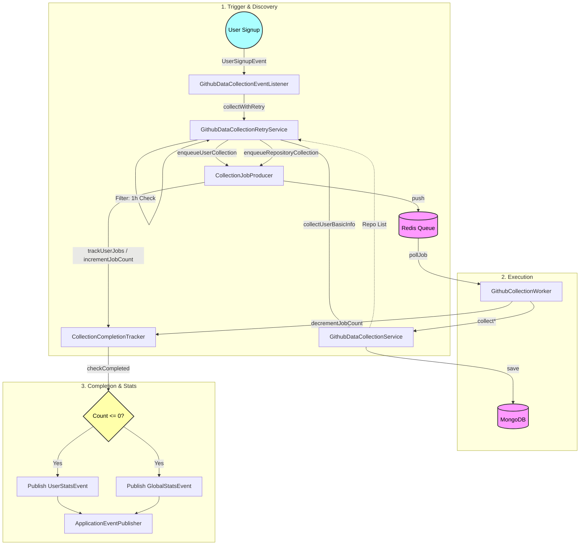

# GitHub 데이터 수집 프로세스 및 로직

이 문서는 KOSP의 GitHub 데이터 수집 시스템의 동작 흐름과 로직을 중심으로 기술합니다. (관련 컴포넌트는 괄호 안에 표기)

## 1. 전체 데이터 흐름 (Data Flow Overview)

데이터 수집은 **트리거(Trigger)**에서 시작하여 **탐색(Discovery)**, **작업 생성(Queueing)**, **실행(Execution)**, 그리고 **통계 산출(Statistics)**의 순서로 진행됩니다.



---

## 2. 프로세스 상세 (Process Detail)

### 2.1. 수집 트리거 (Triggering Phase)
수집 프로세스는 시스템 외부의 이벤트나 스케줄러에 의해 시작됩니다. 현재 시스템은 두 가지 다른 방식의 수집 로직을 혼용하고 있습니다.

| 트리거 소스 | 이벤트/잡 이름 | 대상 | 실행 방식 | 관련 컴포넌트 |
| :--- | :--- | :--- | :--- | :--- |
| **회원가입** | `UserSignupEvent` | 신규 가입자 1명 | **신규 큐 시스템** (비동기) | `GithubDataCollectionEventListener` -> `GithubDataCollectionRetryService.collectWithRetry()` |
| **매시 정각** | `dataCollectionJob` (Spring Batch) | 전체 사용자 | **레거시 배차** (동기) | `BatchScheduler` -> `DataCollectionJobConfig` -> `GithubDataCollectionRetryService.collectAllData()` |

> **⚠️ 주의 (Architectural Divergence)**: 
> 현재 회원가입 시에는 `collectWithRetry()`를 통해 **Redis 큐 기반의 비동기 수집**이 이루어지지만, 정기 스케줄링 시에는 `collectAllData()`를 통해 **동기식 순차 수집**이 수행됩니다. 이는 향후 정기 스케줄링도 큐 기반으로 통합해야 하는 기술 부채입니다.

### 2.2. 범위 분석 및 탐색 (Discovery & Analysis Phase)
어떤 데이터를 수집해야 하는지 결정하는 단계입니다. 단순히 모든 데이터를 긁어오는 것이 아니라, **중복을 방지**하고 **필요한 데이터만 선별**하는 로직이 수행됩니다.
1.  **기본 작업 예약**: 사용자 프로필 정보(`USER_BASIC`)와 활동 내역(`USER_EVENTS`) 수집 작업은 무조건 생성됩니다.
2.  **레포지토리 목록 조회**: 사용자가 접근 가능한 모든 레포지토리 목록을 GitHub API를 통해 실시간으로 조회합니다. (`collectUserBasicInfo` - 동기 호출)
3.  **수집 필터링 (Deduplication Logic)**: 조회된 각 레포지토리에 대해 메타데이터를 확인합니다.
    *   **로직**: "해당 레포지토리가 마지막으로 수집된 지 1시간이 지났는가?"
    *   **Yes**: 수집 대상(`REPO_COMMITS`, `REPO_ISSUES`, `REPO_PRS`)으로 분류.
    *   **No**: 최근에 수집되었으므로 스킵 (API Quota 절약).

### 2.3. 데이터 수집 분석 매트릭스 (Data Analysis Matrix)
`github-contribution-spec.md`의 목차 순서에 맞춰, 수집 데이터와 API 매핑을 표로 정리했습니다.

#### 0. 기여 저장소 정의 (Definition)
| 데이터 | 필요 필드 | 소스 API (API Mapping) |
| :--- | :--- | :--- |
| **Is Fork** | `isFork` | `GraphQL user.repositories.nodes.isFork` |
| **Commit/PR** | `count` | `REST /commits`, `REST /pulls` |

#### 1. 최근 기여활동 (Recent Activity)
| 데이터 | 설명 | 소스 API (API Mapping) |
| :--- | :--- | :--- |
| **repo_name** | 저장소 이름 | `GraphQL user.repositories.nodes.name` |
| **description** | 설명 | `GraphQL user.repositories.nodes.description` |
| **stargazers_count** | 스타 수 | `GraphQL user.repositories.nodes.stargazers.totalCount` |
| **user_commit_count** | 내 커밋 수 | `REST /repos/{owner}/{repo}/commits?author={me}` (Link Header) |
| **user_pr_count** | 내 PR 수 | `REST /search/issues?q=repo:{owner}/{repo}+is:pr+author:{me}` |
| **last_commit_date** | 최근 커밋 | `REST /repos/{owner}/{repo}/commits?author={me}` (`[0].date`) |

#### 2. 전체 기여 내역 (Overall History)
| 데이터 | 설명 | 소스 API (API Mapping) |
| :--- | :--- | :--- |
| **contributed_repo_count** | 기여 레포 수 | (Derived) 수집된 레포지토리 고유 개수 |
| **total_commit_count** | 총 커밋 수 | (Derived) `user_commit_count` 합계 |
| **total_additions** | 추가 라인 | `REST /repos/{owner}/{repo}/commits/{sha}` (`stats.additions`) |
| **total_deletions** | 삭제 라인 | `REST /repos/{owner}/{repo}/commits/{sha}` (`stats.deletions`) |
| **total_issue_count** | 총 이슈 수 | `REST /search/issues?q=type:issue+author:{me}` |
| **total_pr_count** | 총 PR 수 | `REST /search/issues?q=type:pr+author:{me}` |

#### 3. 기여내역 비교 (Comparison)
| 데이터 | 설명 | 소스 API (API Mapping) |
| :--- | :--- | :--- |
| **avg_*_count** | 평균 수치 | MySQL `github_statistics` (Global Aggregation) |
| **user_star_count** | 내 스타 수 | (Derived) `stargazers_count` 합계 (Not Fork) |
| **user_*_count** | 내 수치 | (Above) 위 섹션의 Total Count 재사용 |

#### 4. GitHub 기여점수 데이터 (Score Data)
| 데이터 | 설명/조건 | 소스 API (API Mapping) |
| :--- | :--- | :--- |
| **Owner** | 레포 소유자 | `GraphQL user.repositories.nodes.owner.login` |
| **Base Stars** | 외부 기여 확인 | `REST /pulls` (`base.repo.stargazers_count`) |
| **Merged At** | PR 병합 확인 | `REST /pulls` (`merged_at`) |
| **Head/Base Owner** | 포크 병합 확인 | `REST /pulls` (`head.repo.owner` vs `base`) |
| **Closed By** | 이슈 해결 확인 | `REST /issues` (`closed_by`) |

---

### 2.4. API 및 응답 데이터 구조 (JSON Reference)
각 API의 실제 응답 구조입니다. 개발 및 디버깅 시 참조하십시오.

#### 1. GraphQL API (User & Repository Meta)
*   **Endpoint**: `POST /graphql`
*   **수집 범위 (Collection Scope)**: **제한 없음** (접근 가능한 모든 저장소, 페이지네이션 포함)
*   **Request Body**:
    ```json
    {
      "query": "query GetUserWithPaginatedRepos($login: String!, $cursor: String) { user(login: $login) { repositories(first: 100, after: $cursor) { pageInfo { hasNextPage endCursor } nodes { stargazerCount ... } } } }",
      "variables": {
        "login": "String",
        "cursor": "String (Optional)"
      }
    }
    ```
*   **Response Schema**:
    ```json
    {
      "data": {
        "user": {
          "login": "String",
          "repositories": {
            "pageInfo": {
              "hasNextPage": "Boolean",
              "endCursor": "String"
            },
            "nodes": [
              {
                "name": "String",
                "isFork": "Boolean",
                "stargazers": { "totalCount": "Integer" },
                "owner": { "login": "String" }
              }
            ]
          }
        }
      }
    }
    ```

#### 2. REST API (Activity & Details)
*   **Commit List** (`GET /repos/{owner}/{repo}/commits?author={me}`)
    *   **수집 범위**: **제한 없음** (전체 커밋 히스토리, 페이지네이션 포함)
    *   **Schema**:
    ```json
    [
      {
        "sha": "String",
        "commit": { "author": { "date": "ISO8601" } },
        "author": { "login": "String" }
      }
    ]
    ```
*   **Commit Detail** (`GET /repos/{owner}/{repo}/commits/{sha}`)
    *   **수집 범위**: **단일 항목** (특정 커밋)
    *   **Schema**:
    ```json
    {
      "stats": {
        "additions": "Integer",
        "deletions": "Integer"
      }
    }
    ```
*   **Pull Requests** (`GET /repos/{owner}/{repo}/pulls?state=all`)
    *   **수집 범위**: **제한 없음** (Closed/Merged 포함 전체 히스토리, `state=all`)
    *   **Schema**:
    ```json
    [
      {
        "number": "Integer",
        "state": "String",
        "merged_at": "ISO8601",
        "base": {
          "repo": {
            "stargazers_count": "Integer",
            "owner": { "login": "String" }
          }
        },
        "head": { "repo": { "owner": { "login": "String" } } }
      }
    ]
    ```
*   **Issues** (`GET /repos/{owner}/{repo}/issues?state=all`)
    *   **수집 범위**: **제한 없음** (Closed 포함 전체 히스토리, `state=all`)
    *   **Schema**:
    ```json
    [
      {
        "number": "Integer",
        "state": "String",
        "closed_by": { "login": "String" }
      }
    ]
    ```
*   **Search Count (Issues)** (`GET /search/issues?q=repo:{repo}+type:issue+author:{me}`)
    *   **수집 범위**: **제한 없음** (전체 기간 합계)
    *   **참고**: `total_count`만 반환. `user_issue_count`와 일치.
*   **Search Count (PRs)** (`GET /search/issues?q=repo:{repo}+type:pr+author:{me}`)
    *   **수집 범위**: **제한 없음** (전체 기간 합계)
    *   **참고**: `total_count`만 반환. `user_pr_count`와 일치.

---

### 2.5. 크롤링(Scraping) 필요성 및 명세 매핑 분석
현재 구현된 두 가지 스크래핑 서비스(`GithubHtmlScrapingService`, `GithubTimelineScrapingService`)가 명세와 어떤 관계가 있는지 분석한 내용입니다.

#### A. Timeline Scraping (`GithubTimelineScrapingService`)
*   **수집 데이터**: 사용자의 타임라인 HTML을 파싱하여 `Created issue`, `Opened PR`, `Pushed commits` 이벤트를 수집.
*   **명세 관련성 (Spec Map)**:
    *   **Spec 1 (최근 활동)**: API (`/users/{id}/events`)는 최근 90일/300건 제한이 있습니다. 타임라인 스크래핑은 이를 넘어선 **과거의 Spec 1, 2 데이터 (User Commit/PR/Issue Count)** 를 보완하는 **백업 소스** 역할을 합니다.
    *   **활용**: API Rate Limit이 고갈되거나, Events API가 누락된 경우 `user_commit_count` 등을 채우는 데 사용될 수 있습니다.

#### B. HTML Scraping (`GithubHtmlScrapingService`)
*   **수집 데이터**:
    *   `Profile`: Achievements, Highlights (배지 정보)
    *   `Repo Page`: Contributors Count, Releases, Dependencies, **Total Commits (Repo Total)**
*   **명세 관련성 (Spec Map)**:
    *   **Spec 관련 없음 (Out of Scope)**: 현재 `github-contribution-spec.md`는 **개인의 통계**에 집중하고 있습니다. 이 서비스가 수집하는 '레포지토리 자체의 총 커밋 수'나 '의존성', '배지' 정보는 현재 명세에는 포함되지 않은 **부가 정보(Legacy Feature)** 입니다.
    *   **조치 요망 (Action Required)**: 현재 명세에 포함되지 않는 불필요한 코드이므로, 리팩토링 단계에서 **삭제(Deletion)** 해야 합니다.

### 2.6. 상세 점수 산출 데이터 (Scoring Criteria)
수집된 데이터가 실제 점수로 환산되는 기준입니다.

**A. 활동 수준 (Activity Level) - Max 3.0점**

| 점수 (Max) | 조건 | 구현 로직 | 비고 |
| :--- | :--- | :--- | :--- |
| **3.0** | 커밋 100+ & PR 20+ | `commits >= 100 && prs >= 20` | 상위 1% 목표 |
| **2.0** | 커밋 30+ & PR 5+ | `commits >= 30 && prs >= 5` | - |
| **1.0** | 커밋 5+ OR PR 1+ | `commits >= 5 \|\| prs >= 1` | 최소 기여 기준 |

**B. 활동 다양성 (Activity Diversity) - Max 1.0점**

| 점수 (Max) | 조건 | 구현 로직 | 비고 |
| :--- | :--- | :--- | :--- |
| **1.0** | 기여 레포 10개+ | `distinctRepos >= 10` | - |
| **0.7** | 기여 레포 5~9개 | `distinctRepos >= 5` | - |
| **0.4** | 기여 레포 2~4개 | `distinctRepos >= 2` | - |

**C. 활동 영향성 (Activity Impact) - Max 5.0점 (Bonus)**

| 점수 | 항목 | 구현 로직 | 참고 |
| :--- | :--- | :--- | :--- |
| **+2.0** | 스타 100+ 레포 보유 | `isOwned && stars >= 100` | - |
| **+1.5** | 스타 1k+ 외부 기여 | `base.stars >= 1000 && merged` | - |
| **+1.0** | 내 PR로 이슈 해결 | `issue.closed_by == me` | (Proxy 구현) |
| **+0.5** | 포크 레포 원본 병합 | `head.owner != base.owner` | - |

> **관련 컴포넌트**: `GithubScoreCalculator`, `GithubStatisticsService`


#### D. 데이터 전처리 및 가공 (Data Preprocessing)
점수 산출의 정확성을 높이기 위해 수행하는 필터링 및 보정 로직의 상세 내역입니다.

1.  **기여 유효성 필터링 (Contribution Validity)**
    *   **로직 (Logic)**: API 응답의 `closed_by` (이슈) 및 `merged` (PR) 필드를 확인합니다. 단순히 생성만 한 것이 아니라, 실제 본인이 해결(`closed_by=me`)했거나 프로젝트에 코드가 병합(`merged_at!=null`)된 항목만 선별합니다.
    *   **이유 (Why)**: 점수 퍼주기(Gaming)를 방지하기 위함입니다. 단순히 PR을 열거나 이슈를 생성한 것만으로는 점수를 부여하지 않으며, 메인테이너에 의해 **수용된 기여**만 인정합니다.
    *   **활용 (Usage)**: **C. 활동 영향성(Impact)** 점수 산출 시 가점(+1.5, +1.0) 대상으로 사용됩니다.
2.  **외부 기여 식별 (External vs Internal)**
    *   **로직 (Logic)**: PR의 `base.repo.owner`(목적지)와 `head.repo.owner`(출발지)가 다른 경우, 또는 `base.repo.user`가 본인이 아닌 경우를 식별합니다.
    *   **이유 (Why)**: **내 저장소 관리(+2.0)** 와 **오픈소스(타인) 기여(+1.5)** 를 구분하여 점수를 차등 부여하기 위함입니다.
    *   **활용 (Usage)**: **C. 활동 영향성(Impact)** 의 외부 기여 보너스 산출에 사용됩니다.
3.  **프록시 로직 (Proxy Logic for 'Solved')**
    *   **로직 (Logic)**: GitHub API는 "이 이슈를 누가 해결했나"를 명시적으로 주지 않는 경우가 있어, `closed_by` 필드를 '해결 주체'로 간주하는 프록시 로직을 사용합니다. (단, 메인테이너가 대신 닫는 경우 오차가 있을 수 있음)
    *   **이유 (Why)**: API 데이터의 한계로 인해 근사치(Proxy) 지표를 사용할 수밖에 없기 때문입니다.
    *   **활용 (Usage)**: **C. 활동 영향성(Impact)** 의 '내 PR로 이슈 해결(+1.0)' 여부 판단에 사용됩니다.
4.  **데이터 중복 방지 (Deduplication)**
    *   **로직 (Logic)**: 이슈 통계를 산출할 때, `GithubIssueRaw` 중 **`pull_request` 객체가 없는 순수 이슈**만 필터링하여 카운트합니다.
    *   **이유 (Why)**: GitHub REST API의 `/issues` 엔드포인트는 설계상 **PR도 포함하여 반환**합니다. (PR은 특별한 형태의 이슈로 취급됨) 이를 별도 조치 없이 합산하면, `/pulls`에서 센 PR이 `/issues`에서도 세어져 **이중 카운트(Double Counting)** 되어 점수가 뻥튀기됩니다.
    *   **활용 (Usage)**: **B. 활동 수준(Activity)** 의 'Total Issues' 개수를 정확히 산출하기 위해 사용됩니다.
5.  **적용 범위 (Scope of Application)**
    *   **설명**: 위 전처리 로직은 개인의 점수뿐만 아니라, **전체 통계(Global Averages)** 산출 시에도 동일하게 적용됩니다.
    *   **문맥 (Context)**:
        *   **Why**: 개인의 수치(`user_issue_count`)는 전처리를 거치고 평균(`avg_issue_count`)은 거치지 않으면, 기준이 달라져 올바른 비교가 불가능합니다(Apple-to-Orange Comparison 방지).
        *   **Where Used**: `github-contribution-spec.md`에 정의된 **모든 통계 지표(Average, Comparison, Tier)**의 기반 데이터로 공통 사용됩니다.

### 2.7. [Phase 1] 트리거, 탐색 및 작업 생성 (Trigger, Discovery & Queueing)
수집 프로세스의 시작점부터 작업이 큐에 들어가기까지의 전 과정(Phase 1)입니다. 다이어그램의 `User -> Listener -> RetryService -> DataService -> Producer` 흐름을 따릅니다.

#### 1. 수집 트리거 (Triggering)
*   **시작**: `UserSignupEvent`가 발행되면 `GithubDataCollectionEventListener`가 이를 수신합니다.
*   **재시도 서비스 호출**: 리스너는 `GithubDataCollectionRetryService.collectWithRetry()`를 호출하여 안정적인 수집 프로세스를 위임합니다.

#### 2. 범위 분석 및 탐색 (Discovery & Analysis)
*   **레포지토리 목록 확보**: `RetryService`는 `DataService.collectUserBasicInfo()`를 호출하여 사용자가 접근 가능한 모든 레포지토리 목록을 가져옵니다.
*   **중복 필터링 (1h Check)**: 가져온 레포지토리 중, 마지막 수집(`last_collected_at`)으로부터 1시간이 지나지 않은 항목은 자동으로 제외하여 API 낭비를 방지합니다.

#### 3. 작업 생성 및 큐 관리 (Queueing Strategy)
*   **큐잉 (Enqueue)**: 필터링을 통과한 수집 대상들은 `CollectionJobProducer`를 통해 **작업(Job)**으로 변환되어 `Redis ZSet`에 등록됩니다.
*   **우선순위 (Priority)**:
    *   **Normal**: 즉시 실행을 위해 현재 시간 Score 부여.
    *   **Delayed**: 재시도/RateLimit 건은 미래 시간 Score 부여.
*   **개수 추적 (Tracking)**: 작업을 큐에 넣음과 동시에 `CollectionCompletionTracker`의 카운터를 증가시켜, 총 수행해야 할 작업 개수를 확정합니다.

### 2.8. [Phase 2] 작업 실행 및 데이터 수집 (Execution Phase)
백그라운드 워커가 큐에서 작업을 꺼내 실제 GitHub API를 호출하고 데이터를 저장하는 **Phase 2** 단계입니다.

#### 1. 실행 루프 (Execution Loop)
*   **폴링 및 선점 (Atomic Polling)**: 워커는 1초 단위로 큐를 확인하며, `ZPOPMIN`을 통해 가장 급한 작업을 꺼냄과 동시에 큐에서 삭제하여 경쟁 상태(Race Condition)를 방지합니다.
*   **보안 (Token Decryption)**: 저장된 GitHub 토큰은 암호화되어 있으며, API 호출 직전에만 복호화하여 사용하고 즉시 메모리에서 해제합니다.
*   **예외 처리 (Error Handling)**:
    *   **Rate Limit**: `403 Retry-After` 응답 시, 해당 시간만큼 대기하도록 작업을 재스케줄링(Reschedule)하여 큐에 다시 넣습니다. (실패 아님)
    *   **General Error**: 최대 5회까지 지수 백오프(Exponential Backoff)로 재시도하며, 초과 시 영구 실패 처리합니다.

#### 2. 수집 구현 상세 (Deep Dive)
각 데이터 유형별로 최적화된 수집 로직이 적용되어 있습니다.

**A. 사용자 기본 정보 (`collectUserBasicInfo`)**
*   **API**: GitHub GraphQL API v4를 사용합니다.
*   **전처리 (Pre-aggregation)**: 사용자의 프로필 정보와 레포지토리 목록을 가져옵니다. 이때 `nodes.stargazers.totalCount`를 함께 조회하고, Java Stream으로 이를 합산하여 **'총 스타 수(Total Stars)'** 를 계산합니다.
    *   *참고: 이는 Phase 3의 '점수 산출'과는 별개로, Raw Data(`GithubUserBasicRaw`)를 저장하기 위한 **수집 단계에서의 단순 합산**입니다.*
*   **페이지네이션**: 레포지토리가 100개를 넘을 경우, `cursor`를 사용하여 재귀적으로 모든 레포지토리를 가져옵니다. (상세 구조는 2.4 참조)

**B. 커밋 상세 (`collectCommitDetail`)**
*   **비용 절약 (Skip Logic)**: 수집하려는 커밋의 SHA가 이미 DB(`GithubCommitRaw`)에 존재한다면, API를 호출하지 않고 즉시 종료합니다.
*   **데이터 보정**: GitHub API의 `commit.author`(Git 설정 정보)와 `author`(GitHub 계정 정보)를 병합하여, 이메일 기반의 커밋을 실제 GitHub 사용자와 연결합니다.

**C. 이슈 및 PR (`collectIssues`, `collectPullRequests`)**
*   **범위 설정**: REST API의 `state=all` 파라미터를 사용하여, 현재 열려있는 것뿐만 아니라 닫히거나 병합된 과거 내역까지 모두 가져옵니다.
*   **배치 처리**: 대량의 데이터를 효율적으로 처리하기 위해, 100개 단위로 메모리에 버퍼링했다가 `saveAll`로 한 번에 MongoDB에 저장합니다(Bulk Insert).
*   **유일성 보장**: `repoOwner` + `repoName` + `number`를 복합 인덱스로 사용하여 데이터 중복을 방지합니다.

**D. 사용자 이벤트 (`collectUserEvents`)**
*   **제약 사항**: GitHub Events API는 최근 90일 또는 300건의 데이터만 제공합니다.
*   **저장 방식**: 응답받은 JSON 리스트를 별도의 파싱 없이 `List<Map>` 형태로 통째로 저장합니다. 상세 분석은 통계 산출 단계에서 필요 시(타임라인 분석 등) 수행합니다.

**E. 레포지토리 기여 분석 (Legacy Features)**
*   Legacy Batch(`Feature 7`)에서 사용되는 로직들입니다. `/contributors`, `/releases`, `/contents/README.md` 등을 호출하여 부가 정보를 수집합니다.

### 2.9. [Phase 3] 완료 감지 및 통계 산출 (Completion & Statistics)
모든 개별 작업이 종결된 후, 최종적으로 통계를 산출하는 **Phase 3** 단계입니다.

*   **완료 감지 (Completion Detection)**
    *   **카운트다운**: 워커가 작업을 성공하거나 영구 실패할 때마다, Redis에 기록된 '남은 작업 수'를 1씩 차감합니다.
    *   **트리거**: 남은 작업 수가 **0**이 되는 순간, 시스템은 수집 종료로 판단하고 이벤트를 발행합니다.
*   **통계 산출 (Statistics Calculation)**
    1.  **개인 통계 (`Personal Stats`)**: `GithubScoreCalculator`가 DB의 Raw Data를 집계하여 활동/다양성/영향력 점수와 티어를 산출합니다.
    2.  **전사 통계 (`Global Stats`)**: 개인 통계 갱신 직후, 전사 평균과 상위 % 랭킹 정보를 재계산하여 업데이트합니다.
*   **관련 컴포넌트**: `CollectionCompletionTracker`, `GithubStatisticsService`, `GlobalStatisticsCalculator`

### 3. 핵심 식별자 및 데이터 (Key Identifiers)

시스템 내에서 흐르는 주요 데이터의 식별자는 다음과 같습니다.

| 데이터 | 저장소 | 설명 |
| :--- | :--- | :--- |
| **작업 (Job)** | Redis | `github:collection:priority_queue` (실행 대기열) |
| **원본 데이터 (Raw Data)** | MongoDB | `github_commit_raw`, `github_issue_raw` 등 API 응답 원본 |
| **메타데이터 (Metadata)** | MongoDB | `github_collection_metadata` (마지막 수집 시간 기록) |
| **통계 (Statistics)** | MySQL | `github_statistics` (계산된 점수 및 티어) |


### 4. 클래스별 상세 기능 명세 (Class Responsibility Matrix)

시스템을 구성하는 주요 클래스와 각 클래스의 세부 기능 정의입니다.

- GithubDataCollectionEventListener: UserSignupEvent 구독
- GithubDataCollectionEventListener: 수집 재시도 서비스(RetryService) 실행 트리거
- GithubDataCollectionRetryService: collectWithRetry 메소드를 통한 안정적 수집 실행
- GithubDataCollectionRetryService: 실패 시 재시도 정책 적용
- GithubDataCollectionService: 사용자 기본 정보 수집 (collectUserBasicInfo)
- GithubDataCollectionService: 1시간 필터링 룰 적용 (Repo Filtering)
- GithubDataCollectionService: 수집된 데이터 저장 및 파이프라인 관리
- CollectionJobProducer: 수집 작업 생성 (Create Jobs)
- CollectionJobProducer: Redis ZSet에 작업 등록 (Push Jobs)
- CollectionJobProducer: 작업 우선순위 스케줄링 (Priority Scheduling)
- CollectionCompletionTracker: 사용자별 총 작업 개수 기록 (Init Count)
- CollectionCompletionTracker: 작업 완료 시 카운트 차감 (Decrement)
- CollectionCompletionTracker: 수집 완료 감지 및 이벤트 발행
- GithubCollectionWorker: Redis 큐 폴링 (ZPOPMIN)
- GithubCollectionWorker: 토큰 복호화 및 보안 처리
- GithubCollectionWorker: Rate Limit 핸들링 및 재스케줄링
- GithubCollectionWorker: 데이터 유형별 수집 로직 실행
- GithubGraphQLClient: 사용자 프로필 및 레포지토리 목록 조회 (GraphQL)
- GithubGraphQLClient: 스타 수 등 메타데이터 전처리 (Pre-aggregation)
- GithubRestApiClient: 커밋 상세 내역 조회 (REST)
- GithubRestApiClient: 이슈 및 PR 목록 조회 (REST)
- GithubRestApiClient: 사용자 이벤트 조회 (REST)
- GithubScoreCalculator: 활동 점수(Activity Score) 계산
- GithubScoreCalculator: 다양성 점수(Diversity Score) 계산
- GithubScoreCalculator: 영향력 점수(Impact Score) 계산
- GithubScoreCalculator: 최종 티어(Tier) 산정
- GithubStatisticsService: 개인 통계 데이터 DB 저장
- GithubStatisticsService: 전사 통계 재산출 요청 이벤트 발행
- GlobalStatisticsCalculator: 전사 평균 통계 산출
- GlobalStatisticsCalculator: 상위 랭킹 및 백분위 계산
- GithubDataCollectionScheduler: 배치 기반 정기 수집 트리거 (Hourly)
- GithubHtmlScrapingService: (Legacy) HTML 기반 부가 정보 수집
- GithubTimelineScrapingService: (Legacy) 타임라인 기반 백업 데이터 수집

### 5. Spring Batch 아키텍처 및 메타데이터 (Batch Architecture)

대량의 데이터 수집 및 통계 산출을 안정적으로 처리하기 위해 Spring Batch를 사용합니다.

#### 5.1. 배치 작업 메타데이터 (Batch Meta-Data Tables)
Spring Batch는 작업의 상태와 이력을 관리하기 위해 9개의 메타 테이블을 사용합니다. DB 스키마(`V2__add_batch_table.sql`)에 정의된 각 테이블의 역할입니다.

| 테이블명 | 분류 | 역할 및 저장 데이터 | 시점 (When) |
| :--- | :--- | :--- | :--- |
| **BATCH_JOB_INSTANCE** | Job | **작업의 고유 식별자** (Job Name + Job Key). 동일한 파라미터로 실행된 작업을 식별. | Job 시작 시 확인/생성 |
| **BATCH_JOB_EXECUTION** | Job | **실행 이력**. 시작시간(`START_TIME`), 종료시간(`END_TIME`), 상태(`STATUS`, `EXIT_CODE`) 저장. 실패 후 재시도 시 새 레코드 생성. | Job 시작/종료 시 |
| **BATCH_JOB_EXECUTION_PARAMS** | Job | **실행 파라미터**. `timestamp` 등 Job 실행 시 전달된 인자 저장. | Job 시작 시 |
| **BATCH_JOB_EXECUTION_CONTEXT** | Job | **Job 상태 저장**. 작업 중단 시 재시작을 위한 상태 정보(Context) 저장. | 트랜잭션 커밋 시 |
| **BATCH_STEP_EXECUTION** | Step | **단계별 실행 이력**. Read/Write/Filter/Skip Count 및 Commit Count 등 상세 처리 통계 저장. | Step 시작/종료/Chunk 커밋 시 |
| **BATCH_STEP_EXECUTION_CONTEXT** | Step | **Step 상태 저장**. Chunk 처리 중 마지막 처리 위치 등을 저장하여 실패 시 지점 복구 지원. | Chunk 커밋 시 |
| **BATCH_JOB_SEQ** | Sequence | `JOB_INSTANCE_ID` 생성을 위한 시퀀스 관리 테이블. | ID 생성 시 |
| **BATCH_JOB_EXECUTION_SEQ** | Sequence | `JOB_EXECUTION_ID` 생성을 위한 시퀀스 관리 테이블. | ID 생성 시 |
| **BATCH_STEP_EXECUTION_SEQ** | Sequence | `STEP_EXECUTION_ID` 생성을 위한 시퀀스 관리 테이블. | ID 생성 시 |

#### 5.2. 배치 작업 명세 및 스케줄링 (Job Specification)

**A. 스케줄러 (`BatchScheduler`)**
*   **실행 시점**: 매시 정각 (`0 0 * * * *`)
*   **동작 방식**: 현재 시간(`timestamp`)을 파라미터로 하여 1. 수집(`dataCollectionJob`), 2. 통계(`statisticsCalculationJob`)를 순차적으로 실행합니다.

**B. 작업 상세 (Job Details)**

| 작업명 (Job) | 단계 (Step) | Reader (불러오기) | Processor (처리) | Writer (저장/종료) |
| :--- | :--- | :--- | :--- | :--- |
| **`dataCollectionJob`** | `collectDataStep` | **GithubUserRepository**<br>모든 사용자 조회 (`findAll`) | **DataCollectionProcessor**<br>1. 토큰 복호화<br>2. Rate Limit 체크<br>3. `collectAllData` 호출 (데이터 수집)<br>4. `statisticsService` 호출 (통계 갱신) | **LogWriter**<br>완료 로그 출력 (실질적 저장은 Service에서 수행) |
| **`statisticsCalculationJob`** | `calculateStatisticsStep` | **GithubUserRepository**<br>모든 사용자 조회 | **StatisticsProcessor**<br>`calculateAndSaveAllStatistics` 호출 (통계 재산출) | **LogWriter**<br>완료 로그 출력 |

*   **참고 (Redis Queue 연동)**: 현재 `dataCollectionJob`은 **동기식**(`collectAllData`)으로 실행되어 Redis Queue를 사용하지 않습니다. (Queue는 `2.7 Phase 1`의 이벤트 트리거에서만 사용됨).

**C. 데이터 흐름 (Data Flow)**
1.  **Read**: MySQL(`users`)에서 대상 사용자들을 Chunk 단위(10개)로 불러옵니다.
2.  **Process**:
    *   **Call**: GitHub API를 호출하여 Raw Data(JSON)를 수집합니다.
    *   **Save**: MongoDB(`github_*_raw`)에 원본 데이터를 적재합니다.
    *   **Calculate**: MySQL(`github_statistics`)에 계산된 통계 데이터를 저장/갱신합니다.
3.  **Write/Commit**: Chunk 단위 처리가 완료되면 Batch 메타 테이블(`BATCH_STEP_EXECUTION` 등)에 처리 건수와 상태를 커밋합니다. 오류 발생 시, 설정된 정책(Retry/Skip)에 따라 동작합니다.


### 6. 주요 소스코드 파일 구조 (Project Structure)

GitHub 데이터 수집 및 분석 프로세스와 관련된 주요 파일들의 디렉토리 구조입니다.

```
kr.ac.koreatech.sw.kosp.domain.github
├── api
│   └── GithubApi.java
├── batch
│   ├── DataCollectionJobConfig.java
│   ├── StatisticsCalculationJobConfig.java
│   └── BatchScheduler.java
├── client
│   ├── graphql
│   │   └── GithubGraphQLClient.java
│   └── rest
│       ├── GithubRestApiClient.java
│       ├── RateLimitException.java
│       └── RateLimitManager.java
├── config
│   └── GithubWorkerConfig.java
├── controller
│   ├── GithubController.java
│   └── GithubTestController.java
├── deprecated (Legacy Code)
│   ├── GithubLanguageStatistics.java
│   ├── GithubLanguageStatisticsRepository.java
│   ├── GithubScoreConfig.java
│   ├── GithubScoreConfigController.java
│   ├── GithubScoreConfigRepository.java
│   ├── LanguageDistributionResponse.java
│   └── LanguageStatisticsCalculator.java
├── dto
│   ├── StatisticsComparisonResponse.java
│   ├── UserSyncResult.java
│   └── response
│       ├── ActivityTimelineResponse.java
│       ├── ContributionOverviewResponse.java
│       ├── ContributionPatternResponse.java
│       ├── GithubAnalysisResponse.java
│       ├── GithubContributionComparisonResponse.java
│       ├── GithubContributionScoreResponse.java
│       ├── GithubMonthlyActivityResponse.java
│       ├── GithubOverallHistoryResponse.java
│       ├── GithubRecentActivityResponse.java
│       ├── GithubRecentContributionsResponse.java
│       ├── GithubSummaryResponse.java
│       ├── GlobalStatisticsResponse.java
│       ├── RepositoryStatsResponse.java
│       └── YearlyAnalysisResponse.java
├── event
│   ├── GithubDataCollectionEventListener.java
│   ├── GithubStatisticsEventListener.java
│   ├── GlobalStatisticsCalculationRequestedEvent.java
│   └── UserStatisticsCalculationRequestedEvent.java
├── exception
│   └── RateLimitExceededException.java
├── model
│   ├── FailureType.java
│   ├── GithubContributionPattern.java
│   ├── GithubGlobalStatistics.java
│   ├── GithubMonthlyStatistics.java
│   ├── GithubRepositoryStatistics.java
│   ├── GithubUser.java
│   ├── GithubUserStatistics.java
│   ├── GithubYearlyStatistics.java
│   └── RateLimitInfo.java
├── mongo
│   ├── document (Raw Data Entities)
│   │   ├── GithubCollectionMetadata.java
│   │   ├── GithubCommitDetailRaw.java
│   │   ├── GithubCommitRaw.java
│   │   ├── GithubIssueRaw.java
│   │   ├── GithubIssuesRaw.java
│   │   ├── GithubPRRaw.java
│   │   ├── GithubPRsRaw.java
│   │   ├── GithubRepoContribute.java
│   │   ├── GithubTimelineData.java
│   │   ├── GithubTimelineIssue.java
│   │   ├── GithubTimelinePR.java
│   │   ├── GithubUserBasicRaw.java
│   │   ├── GithubUserEventsRaw.java
│   │   ├── GithubUserFollowing.java
│   │   └── GithubUserStarred.java
│   ├── model
│   │   ├── GithubProfile.java
│   │   ├── GithubRepository.java
│   │   └── GithubTrend.java
│   └── repository (Mongo Repositories)
│       ├── GithubCommitDetailRawRepository.java
│       ├── GithubCommitRawRepository.java
│       ├── GithubIssueRawRepository.java
│       ├── GithubIssuesRawRepository.java
│       ├── GithubPRRawRepository.java
│       ├── GithubPRsRawRepository.java
│       ├── GithubProfileRepository.java
│       ├── GithubRepoContributeRepository.java
│       ├── GithubRepositoryRepository.java
│       ├── GithubTimelineDataRepository.java
│       ├── GithubTrendRepository.java
│       ├── GithubUserBasicRawRepository.java
│       ├── GithubUserFollowingRepository.java
│       ├── GithubUserStarredRepository.java
│       ├── MongoGithubCollectionMetadataRepository.java
│       └── MongoGithubUserEventsRawRepository.java
├── queue
│   ├── controller
│   │   └── CollectionMonitoringController.java
│   ├── dto
│   │   └── QueueStatsResponse.java
│   ├── model
│   │   ├── CollectionJob.java
│   │   └── CollectionJobType.java
│   └── service
│       ├── CollectionCompletionTracker.java
│       ├── CollectionJobMonitoringService.java
│       ├── CollectionJobProducer.java
│       └── GithubCollectionWorker.java
├── repository (MySQL Repositories)
│   ├── GithubContributionPatternRepository.java
│   ├── GithubGlobalStatisticsRepository.java
│   ├── GithubMonthlyStatisticsRepository.java
│   ├── GithubRepositoryStatisticsRepository.java
│   ├── GithubUserRepository.java
│   ├── GithubUserStatisticsRepository.java
│   └── GithubYearlyStatisticsRepository.java
└── service
    ├── ContributionPatternCalculator.java
    ├── FailureAnalyzer.java
    ├── GithubCommitCollectionService.java
    ├── GithubDataCollectionRetryService.java
    ├── GithubDataCollectionService.java
    ├── GithubHtmlScrapingService.java
    ├── GithubPRIssueCountService.java
    ├── GithubRateLimitChecker.java
    ├── GithubScoreCalculator.java
    ├── GithubService.java
    ├── GithubStatisticsService.java
    ├── GithubTimelineScrapingService.java
    ├── GlobalStatisticsCalculator.java
    ├── MonthlyStatisticsCalculator.java
    ├── RepositoryStatisticsCalculator.java
    ├── StatisticsComparisonService.java
    ├── UserStatisticsCalculator.java
    └── YearlyStatisticsCalculator.java
```

