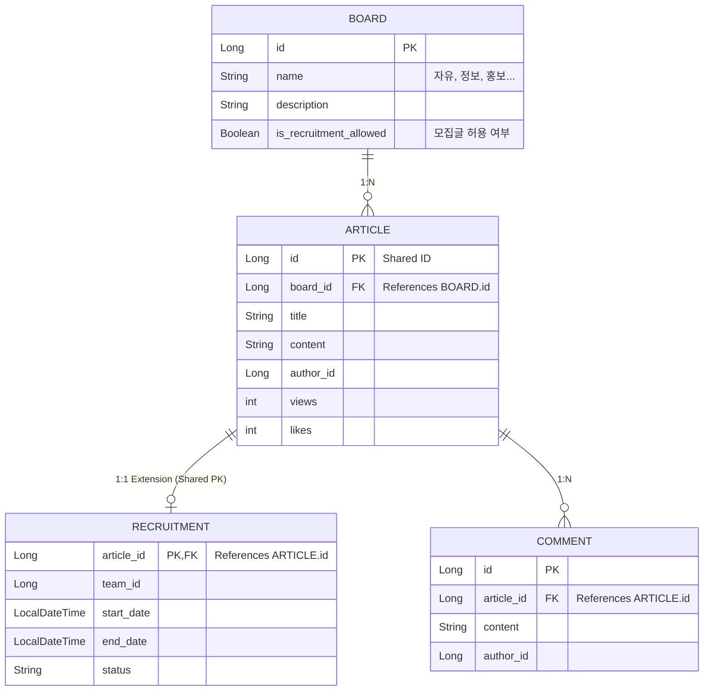

# KOSP 커뮤니티 도메인 구조

## 개요
이 문서는 커뮤니티 모듈의 도메인 구조를 설명합니다.
**확장성(Extensibility)**을 위해 정적 카테고리(Enum) 대신 **게시판(Board) 테이블**을 도입합니다.
핵심은 **Article/Recruit 통합 모델**과 **Board 기반 분류**입니다.

## 1. 엔티티 관계 (ERD 개념)

## 2. 구현 전략

### 2.1 Board (게시판 메타데이터)
- **테이블**: `board`
- **역할**: 게시글의 분류 기준(게시판)을 관리합니다.
- **장점**: 관리자가 DB 조작만으로 새로운 게시판(예: 'QA', '유머')을 생성할 수 있습니다(코드 수정 불필요).

### 2.2 Article (기본 엔티티)
- **테이블**: `article`
- **필드 변경**: `category` (Enum) -> `board_id` (FK).
- **역할**: 특정 `Board`에 소속된 글을 저장합니다.

### 2.3 Recruitment (확장 엔티티)
- **역할**: 모집 게시글일 경우 추가 정보를 저장합니다.
- **연동**: 모집 전용 게시판(예: `is_recruitment_allowed=true`)에 작성된 글은 `Recruitment` 정보를 가질 수 있습니다.

### 2.4 Comment (통합 댓글)
- `Article` ID를 통해 연결되므로 구조 변경 없음.

## 3. API 변경 사항
기존 '카테고리' 개념이 '게시판 ID'로 대체됩니다.

- **게시판 목록**: `GET /community/boards` (신규)
- **글 목록**: `GET /community/articles?boardId={id}` (category 파라미터 대체)
- **글 작성**: Body에 `boardId` 포함.
