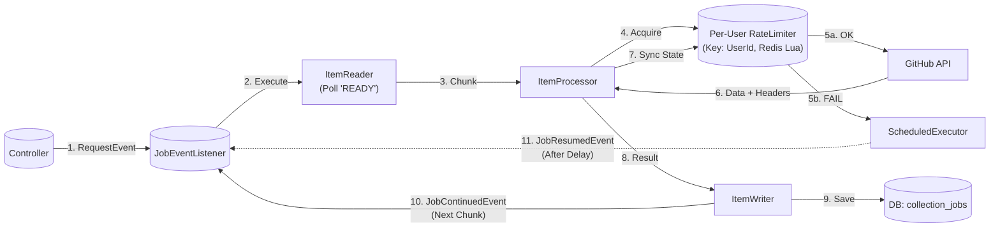

# GitHub Data Collection Refactoring Plan

## 1. 개요 (Overview)
현재 GitHub 데이터 수집 시스템의 구조적 한계와 문제점을 분석하고, 이를 개선하기 위한 리팩터링 계획을 정리하는 문서입니다.

### 주요 문제점 (Key Issues)
1.  **구조의 복잡성 (Messy Structure)**: 비즈니스 로직, 배치 처리, 큐잉 시스템이 혼재되어 있어 파악이 어렵습니다.
2.  **메모리 이슈 (Memory Issues)**: 대량의 데이터 수집 시 OOM(Out of Memory) 가능성이나 메모리 누수 지점이 존재합니다.
3.  **유지보수성 (Maintenance)**: 레거시 코드와 신규 코드가 섞여 있고, 테스트가 어렵거나 의존성이 복잡한 컴포넌트들이 많습니다.

---


## 2. 구조적 문제 상세 (Structural Issues)

### 2.1. 무분별한 전체 수집 (Inefficient Full Fetch)
*   **현황**: 아키텍처 문서(Sec 2.4)에 따르면, Issue/PR 수집 시 `state=all` 파라미터를 사용하여 **전체 히스토리**를 매번 조회하도록 명세되어 있습니다.
*   **문제점**: 데이터가 쌓일수록 수집 시간이 선형적으로 증가하며, GitHub API Rate Limit을 불필요하게 소진합니다. `since` 파라미터를 사용한 증분 수집(Incremental Fetch) 적용이 시급합니다.

### 2.2. 책임의 혼재 (Mixed Responsibilities)
*   `GithubDataCollectionService`가 API 호출, 데이터 필터링(1h Check), DB 저장, 이벤트 발행을 모두 담당하고 있어 단일 책임 원칙(SRP)을 위배합니다.

---

## 3. 시간 기반 수집 가능성 (Time-Based Slicing Feasibility)

사용자가 요청한 **"모든 정보를 시간 기반으로 잘라서 가져오는 구조"**가 현재 아키텍처 문서에 명시된 API를 기준으로 가능한지 분석한 결과입니다.

### 3.1. 분석 결과 요약
| 데이터 유형 (Data Type) | 대상 API (Docs Sec 2.4) | 시간 기반 필터링 지원 여부 | 결론 (Feasibility) |
| :--- | :--- | :--- | :--- |
| **Commits** | `GET /commits` | ✅ 지원 (`since`, `until`) | **가능 (Possible)** |
| **Issues** | `GET /issues` | ✅ 지원 (`since`) | **가능 (Possible)** |
| **Pull Requests** | `GET /pulls` | ⚠️ 제한적 (`updated` 정렬 활용) | **가능 (Possible)** |
| **Events** | `GET /events` | ❌ 불가 (최근 90일 고정) | **불가능 (Impossible)** |

### 3.2. 항목별 상세 분석

#### A. Commits (가능)
*   **명세**: `GET /repos/{owner}/{repo}/commits`
*   **분석**: 표준 GitHub API는 `since` (YYYY-MM-DDTHH:MM:SSZ)와 `until` 파라미터를 완벽히 지원합니다.
*   **제안**: `JobParameter`로 `targetDate`를 넘겨 하루 단위(Daily)로 끊어서 수집하도록 변경 가능합니다.

#### B. Issues & PRs (가능)
*   **명세**: `GET /repos/{owner}/{repo}/issues` (PR 포함)
*   **분석**: `since` 파라미터를 제공하여 **특정 시점 이후에 업데이트된** 항목만 조회할 수 있습니다.
*   **제안**: `created_at` 기준이 아닌 `updated_at` 기준이므로, 수집 후 내부적으로 날짜 필터링이 필요할 수 있으나 기술적으로 시간 기반 슬라이싱이 가능합니다.

#### C. User Events (불가능)
*   **명세**: `GithubDataCollectionEventListener` 등에서 사용
*   **분석**: GitHub Events API는 오직 **최근 300건 또는 90일** 이내 데이터만 제공하므로, 임의의 과거 시점(예: 1년 전) 데이터를 시간 기준으로 잘라서 가져올 수 없습니다.
*   **대안**: Events는 실시간성 데이터이므로 현재 방식을 유지하거나, 과거 데이터는 Commits/Issues API로 대체해야 합니다.

### 3.3. 결론
> **"가능합니다."** (Events 제외)
> 현재 사용 중인 REST API 엔드포인트들은 대부분 시간 파라미터(`since`)를 지원하므로, 아키텍처를 **기간별(Daily/Hourly) 파티셔닝 수집 구조**로 리팩토링하는 것이 가능합니다.

---

## 4. 개선된 아키텍처 설계 (Target Architecture)

사용자 요청에 따라 **회원가입(Signup)**과 **정기 수집(Crawling/Schedule)**이 동일한 **수집 요청 이벤트(DataCollectionRequestEvent)**를 발행하는 **완전한 이벤트 기반 아키텍처**로 재설계합니다.

### 4.1. 통합 배치 아키텍처 (Unified Spring Batch Flow)

모든 수집 작업(Repo, Commit, Issue 등)이 **단일한 Spring Batch Step** 내에서 동일한 흐름으로 처리되는 구조입니다. "Job Type"만 다를 뿐, 실행 메커니즘은 하나로 통일됩니다.

*   **Table Strategy**:
    *   **BATCH_JOB_***: Spring Batch **Framework용 메타데이터**. (배치 실행 이력, 상태, 파라미터 로그용). 수백만 개의 수집 작업(데이터)을 여기에 넣으면 조회 성능이 폭락하므로 **절대 Queue로 사용하지 않습니다.**
    *   **collection_jobs**: 우리가 정의한 **Domain Queue Table**. (대상: Repo, Commit, PR 등). `id`, `priority`, `status`, `payload` 등 꼭 필요한 컬럼만 가진 **Lightweight Table**입니다. Atomic Claim(`UPDATE ... SKIP LOCKED`) 성능 최적화가 목적입니다.

#### The Unified Flow (`JobReader` → `JobProcessor` → `JobWriter`)

1.  **JobReader (Custom Implementation)**:
    *   **Spring Batch 미지원**: Spring Batch의 기본 Reader는 `UPDATE`를 지원하지 않습니다. 따라서 `AtomicJobReader`를 **Custom 구현**해야 합니다.
    *   **순서 (Ordering)**: **Priority(높은순) > CreatedAt(오래된순)**.
    *   **Priority Policy (Finish-First)**:
        *   **High (10)**: `FETCH_REPO_COMMITS`, `FETCH_ISSUES` 등 (진행 중인 하위 작업).
        *   **Low (1)**: `FETCH_ALL_REPOS` (새로운 탐색 작업).
        *   **효과**: Rate Limit이 풀리면, 큐에 쌓인 **'하던 일(Child)'**을 먼저 처리하고, 그 다음에 **'새 일(Cron)'**을 시작합니다.
    *   **Atomic Claim**:
        *   `UPDATE collection_jobs SET status = 'IN_PROGRESS' ... WHERE id IN (`
        *   `  SELECT id FROM collection_jobs WHERE status = 'READY'`
        *   `  ORDER BY priority DESC, created_at ASC`
        *   `  LIMIT {chunkSize} FOR UPDATE SKIP LOCKED`
        *   `) RETURNING *`
2.  **JobProcessor (implements `ItemProcessor`)**:
    *   **역할**: `JobType`에 맞는 수집 전략(Strategy)을 실행합니다.
    *   **패턴**: `Strategy Pattern`
    *   **출력**: `CollectionResult` (수집된 데이터 + 새로 생성된 하위 Jobs).
3.  **JobWriter (implements `ItemWriter`)**:
    *   **역할**: 처리된 Job의 결과를 저장하고, 새로운 Job을 큐에 등록합니다.
    *   **트랜잭션**:
        1.  데이터 `UPSERT`.
        2.  **Next Jobs** (하위/다음페이지) `INSERT` (Status=`READY`).
        3.  Current Job `UPDATE` (Status=`DONE`).

#### Job Lifecycle & Deduplication
*   **Deduplication (중복 방지)**:
    *   `Initial` 및 `Recursive` 단계에서 Job 생성 시, **`(User, Type, Args)`가 동일한 작업**이 이미 `READY` or `IN_PROGRESS` or `PAUSED` 상태라면 **생성을 무시(Skip)**합니다.
    *   **시나리오 (Cron Overlap) - 2중 방어**:
        1.  **Layer 1 (Rate Limit)**: `FETCH_REPO_COMMITS`가 Rate Limit으로 밀려난 상태라면, Cron의 `FETCH_ALL_REPOS`도 토큰 부족으로 실행되지 않고 **지연(Reschedule)**됩니다. (사용자 지적 사항 반영 - 최우선 방어)
        2.  **Layer 2 (Deduplication)**: 만약 토큰이 충전되어 `FETCH_ALL_REPOS`가 실행되더라도, 이미 큐에 있는 하위 작업들을 확인하여 **생성을 무시(Skip)**합니다. (만약의 경우를 대비한 2차 방어)
*   **Initial**: 사용자 요청 시 `Service`가 Deduplication 체크 후 Root Job 생성.
*   **Recursive**: `ItemWriter`가 하위 작업 생성 시에도 동일하게 중복 체크.
*   **Consume**: `ItemReader`가 `READY` 작업을 가져와 `IN_PROGRESS`로 변경.



이 구조를 통해 **모든 수집 로직이 표준화**되며, 로깅/재시도/트랜잭션 관리가 배치 프레임워크 수준에서 일관되게 수행됩니다.

### 4.2. 이벤트 상세 설계 (Event Specification)

| 필드명 | 타입 | 필수 여부 | 설명 |
| :--- | :--- | :--- | :--- |
| **`userId`** | `Long` | **Yes** | KOSP 사용자 식별자 (FK). 데이터 저장의 주체입니다. |

#### 이벤트 구조 (Java Record)
```java
public record DataCollectionRequestEvent(
    Long userId
) {}
```

### 4.3. 작업 단위 정의 (Job Granularity)

**"외부로 1회 호출 = Job 1개"**

*   **원칙 (Principle)**: GitHub API(REST/GraphQL) 호출 1회 또는 스크래핑 1회는 반드시 1개의 독립적인 Job으로 매핑되어야 합니다.
*   **이유 (Why)**:
    1.  **Rate Limit 정밀 제어**: 호출 단위로 재시도(Retry) 및 대기(Backoff)를 수행하여 API 쿼터 고갈을 방지합니다.
    2.  **실패 격리 (Fault Isolation)**: 특정 레포지토리의 커밋 수집이 실패해도, 다른 레포지토리나 프로필 수집에는 영향을 주지 않습니다.
*   **Granular Job 트리 구조 (Data & Trigger Tree)**:

    ```text
    ├── 1. FETCH_ALL_REPOS (Root Discovery)
    │   ├── Source: GraphQL `user.repositories` (Two Independent Requests)
    │   │   ├── Request A: `orderBy: PUSHED_AT` (Collects code activity)
    │   │   └── Request B: `orderBy: UPDATED_AT` (Collects meta/issue activity)
    │   ├── Data: `name`, `owner.id`, `isFork`, `isPrivate`, `stargazers.totalCount`, `updatedAt`, `pushedAt`
    │   └── Trigger (Union Strategy):
    │       ├── Loop A: Fetch next page until `pushedAt < start`
    │       ├── Loop B: Fetch next page until `updatedAt < start`
    │       └── Result: Union(A, B) -> Deduplicate by ID
    │       └── For Each Unique Repo (Conditional Enqueue):
    │           ├── If `repo.pushedAt >= start` -> Enqueue `FETCH_REPO_COMMITS`
    │           └── If `repo.updatedAt >= start` -> Enqueue `FETCH_REPO_ISSUES` & `FETCH_REPO_PRS`
    │           │
    │           ├── 1-A. FETCH_REPO_COMMITS (Activity Score)
    │           │   ├── Source: REST `/repos/{owner}/{repo}/commits`
    │           │   ├── Data: `sha`, `commit.author.date`
    │           │   └── Trigger:
    │           │       ├── Next Page -> Enqueue `FETCH_REPO_COMMITS`
    │           │       └── For New `sha`:
    │           │           └── 1-A-1. FETCH_COMMIT_DETAIL (Stats)
    │           │               ├── Source: REST `/repos/{owner}/{repo}/commits/{sha}`
    │           │               └── Data: `stats.additions`, `stats.deletions`
    │           │
    │           ├── 1-B. FETCH_REPO_ISSUES (Impact Score - Solved)
    │           │   ├── Source: REST `/repos/{owner}/{repo}/issues`
    │           │   ├── Data: `number`, `state`, `closed_at`, `closed_by.id`, `pull_request` (Check)
    │           │   └── Trigger:
    │           │       └── Next Page -> Enqueue `FETCH_REPO_ISSUES`
    │           │
    │           └── 1-C. FETCH_REPO_PRS (Impact Score - External/Fork)
    │               ├── Source: REST `/repos/{owner}/{repo}/pulls`
    │               ├── Data: `number`, `merged_at`, `base.repo.stars`, `head/base.repo.owner.id`
    │               └── Trigger:
    │                   └── Next Page -> Enqueue `FETCH_REPO_PRS`
    ```

---

### 4.4. 락-프리 및 아이뎀포턴시 (Lock-Free & Idempotency)

인위적인 락(Lock)을 사용하지 않고, 작업의 **단위 분리**와 **멱등성(Idempotency)** 보장을 통해 동시성 문제를 해결합니다.

2.  **멱등성 보장 (Idempotency)**:
    *   모든 DB 쓰기 작업은 `UPSERT` (Insert or Update)로 구현합니다.
    *   동일한 커밋/이슈를 중복 수집해도 데이터 무결성이 유지되므로 락이 불필요합니다.
3.  **재귀적 페이지네이션 (Recursive Pagination)**:
    *   **One Job = One API Call**: `FETCH_ALL_REPOS`와 같은 탐색 작업도 단일 페이지 단위로 나눕니다.
    *   **Stateless**: 작업 중간에 Rate Limit으로 멈춰도, 이미 수집된 페이지는 DB에 저장되어 있으므로 **Rollback이 필요 없습니다.** 다음 페이지 작업만 큐(DB)에 남아 나중에 실행됩니다.

### 4.5. 비동기/논블로킹 오케스트레이션 (Event-Driven & Non-Blocking)

폴링(Polling)의 자원 낭비와 락/Sleep의 스레드 점유 문제를 해결하기 위해, **완전한 이벤트 구동 방식(Event-Driven Orchestration)**을 적용합니다.

1.  **실행 흐름 (Flow)**:
    *   **Start**: `DataCollectionRequestEvent` 수신 시 첫 번째 청크(Chunk) 실행.
    *   **Loop (Next Chunk)**: 청크 처리 완료 후, `ItemWriter`가 DB에 남은 작업이 있는지 확인.
        *   있다면: `JobContinuedEvent`를 발행하여 **즉시** 다음 청크 실행. (재귀적 이벤트 루프)
        *   없다면: 종료.
    *   **장점**: 작업이 있을 때만 이벤트가 돌아가므로, 대기 상태에서의 **Polling Overhead가 'Zero'**입니다.

2.  **Rate Limit Handling (Per-User & Atomic)**:
    *   **Per-Token Bucket**: Rate Limit은 토큰(사용자)별로 독립적입니다. Redis Key를 `ratelimit:{userId}`로 관리하여 사용자 간 영향을 주지 않습니다.
    *   **Atomic Operation (Lua Script)**: 동시성 이슈(Race Condition)를 방지하기 위해, 토큰 검사(`check`)와 차감(`decrement`)을 **Redis Lua Script**로 원자적으로 실행합니다.
    *   **Non-Blocking Backoff**: 토큰 부족 시 스레드를 차단하지 않고, `ScheduledExecutor`로 해당 작업만 Refill Time 이후로 **지연 실행(Reschedule)**합니다.
    *   **개별 작업 격리**: `JobResumedEvent`는 부족한 해당 토큰(User)의 작업만 연기하므로, 다른 사용자(User B)의 작업은 정상적으로 병렬 실행됩니다.

3.  **워커 구성**:
    *   **Dynamic Pool**: `availableProcessors()` (t2.micro = 1).
### 4.6. 데이터 무결성 및 중복 원천 차단 (Zero Duplication & Consistency)

사용자의 요청대로 **"중복 데이터 자체가 내려오지 않는"** 완벽한 일관성 전략을 적용합니다. 핵심은 **불변 정렬(Immutable Sort)**과 **시간 고정(Time-Anchoring)**입니다.

1.  **Commits: Time-Anchored Snapshot**
    *   **전략**: `FETCH_REPO_COMMITS` 시작 시간(`T_start`)을 `until` 파라미터로 고정합니다.
    *   **이유**: 작업 도중 푸시된 새 커밋은 API 결과에서 제외되므로, 페이지 밀림(Offset Shift)이 물리적으로 불가능합니다.
2.  **Issues & PRs: Stable Sort Strategy**
    *   **문제**: `sort=updated` 사용 시, 작업 도중 업데이트된 항목이 페이지 맨 앞으로 점프하여 중복/누락(Shifting)을 유발합니다.
    *   **해결**: **`sort=created` + `direction=asc`** + `since={last_collected}` 조합을 사용합니다.
    *   **효율성 (Partial Scan)**: `since` 파라미터 덕분에 전체 역사가 아닌, **변경된 항목들만** 리스트업됩니다. "모든 이슈를 확인"하는 것이 아니라 "변경된 이슈들을 생성일 순으로 정렬"하여 가져옵니다.
    *   **안정성 (Stability) - 시나리오 예시**:
        *   **상황**: `since=어제`, `sort=created(ASC)`로 수집 중. 현재 리스트: `[A(1일), B(2일), C(3일)]`.
        *   **1. Page 1 조회**: `[A, B]` 수집 완료.
        *   **2. 외부 변수 발생**: 아주 오래된 **`Z(0일)`** 이슈에 댓글이 달림 -> `updated_at`이 최신이 됨.
        *   **3. 리스트 변화**: `Z`가 `since` 조건을 만족하게 되어 리스트에 진입. `created` 순이므로 **맨 앞(0번 인덱스)**에 삽입됨.
            *   변경 전: `[A, B, C]`
            *   변경 후: `[Z, A, B, C]`
        *   **4. Page 2 조회**: 오프셋 2(앞에 2개 건너뜀)부터 조회.
            *   가져오는 것: `[B, C]`
            *   **결과**: `B`는 Page 1에서 이미 수집했습니다. **(중복 발생)**
        *   **대응**: `UPSERT`가 B를 다시 덮어쓰므로 **데이터 무결성은 안전**합니다. 반면 `sort=updated`였다면 B가 리스트 밖으로 밀려나 **누락**되었을 것입니다.
    *   **WHY `sort=created`?**:
        *   페이징(Pagination) 때문입니다. `since`로 필터링된 결과가 100페이지라면, 1페이지를 읽는 동안 100페이지에 있던 글이 수정되어 1페이지로 점프(`sort=updated`의 경우)할 수 있습니다.
        *   이 경우, 우리는 이미 1페이지를 지났으므로 그 글을 영영 **놓치게(Missing)** 됩니다.
        *   따라서 **절대 변하지 않는 기준(`created`)**으로 정렬해야만 페이지를 넘길 때 누락이 발생하지 않습니다.
    *   **결론**: `sort=updated`는 항목 이동으로 인한 **누락(Missing)**이 발생하지만, 이 방식은 **중복(Duplicate)**만 발생하므로 훨씬 안전합니다.

### 4.7. 고급 예외 처리 (Advanced Edge Cases)

1.  **좀비 작업 (Zombie Jobs) - "Dirty Read Recovery"**:
    *   **상황**: 워커 프로세스가 `IN_PROGRESS` 마킹 후 **강제 종료(Crash/Deploy)**된 경우. 프로세스는 죽었지만 DB에는 `IN_PROGRESS`로 남아 영원히 아무도 건드리지 못하는 상태.
    *   **대응**: `ZombieCleaner`가 30분(Timeout의 3~5배) 이상 멈춰있는 작업을 발견하면, **"죽은 작업"으로 간주하고 `READY`로 Reset**하여 다른 워커가 심폐소생술(Retry)을 하도록 만듭니다.
2.  **토큰 만료/권한 없음 (Token Invalid)**:
    *   **상황**: 수집 중 401/403 발생.
    *   **대응**: 해당 사용자의 모든 `READY` 작업을 `PAUSED`로 변경하고, 사용자에게 토큰 갱신 요청 알림을 보냅니다. (재시도 루프 방지)
3.  **저장소 삭제/이동 (404/301)**:
    *   **상황**: `FETCH_REPO_COMMITS` 시도 중 404 Not Found.
    *   **대응**: 404면 해당 Repo를 `Deleted` 처리하고 관련 하위 작업 모두 폐기. 301(Moved)이면 DB의 Repo URL을 갱신하고 진행.
4.  **대용량 응답 (Payload Too Large)**:
    *   **상황**: 10만 라인의 커밋 등, DB 저장 한계를 초과하는 데이터.
    *   **대응**: 핵심 메타데이터(통계)만 남기고 상세 코드(Patch)는 Truncate하거나 별도 스토리지(S3 등)로 우회합니다.

---

## 5. 개선 목표 및 로드맵 (Refactoring Roadmap)

제안된 아키텍처로 전환하기 위한 단계별 이행 계획입니다.

### Phase 1: 이벤트 시스템 통합 (Event System Unification)
*   **목표**: `DataCollectionRequestEvent`를 신설하고, 기존 회원가입 로직을 이 이벤트 기반으로 마이그레이션합니다.
*   **작업**:
    1.  `DataCollectionRequestEvent` (Record) 구현 (필드: `userId`, `start`).
    2.  `UnifiedCollectionEventListener` 구현.
        *   **멱등성 보장**: 데이터 저장 시 `UPSERT` 로직 적용 (Lock-Free).

### Phase 2: 디스커버리 잡 구현 (Discovery Job & Scheduler)
*   **목표**: 정기 스케줄러가 직접 수집하지 않고, 이벤트를 발행하도록 변경합니다.
*   **작업**:
    1.  `DiscoveryJob` 신설: 모든 사용자 순회 -> 이벤트 발행(`start=1일전`).
    2.  `BatchScheduler`가 `DiscoveryJob`을 실행하도록 수정.

### Phase 3: 작업 세분화 (Granular Job Implementation)
*   **목표**: "1 Call = 1 Job" 원칙 구현.
*   **작업**:
    1.  기존 `collectAllData`의 통짜 로직을 `GithubCollectionWorker`의 개별 핸들러로 분해.
    2.  페이지네이션 처리 시 재귀적 Job 생성(Recursive Job Enqueue) 로직 구현.

### Phase 4: 레거시 청산 (Legacy Cleanup)
*   동기식 수집 로직 삭제 및 미사용 서비스 제거.

