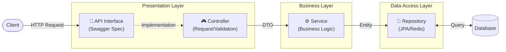
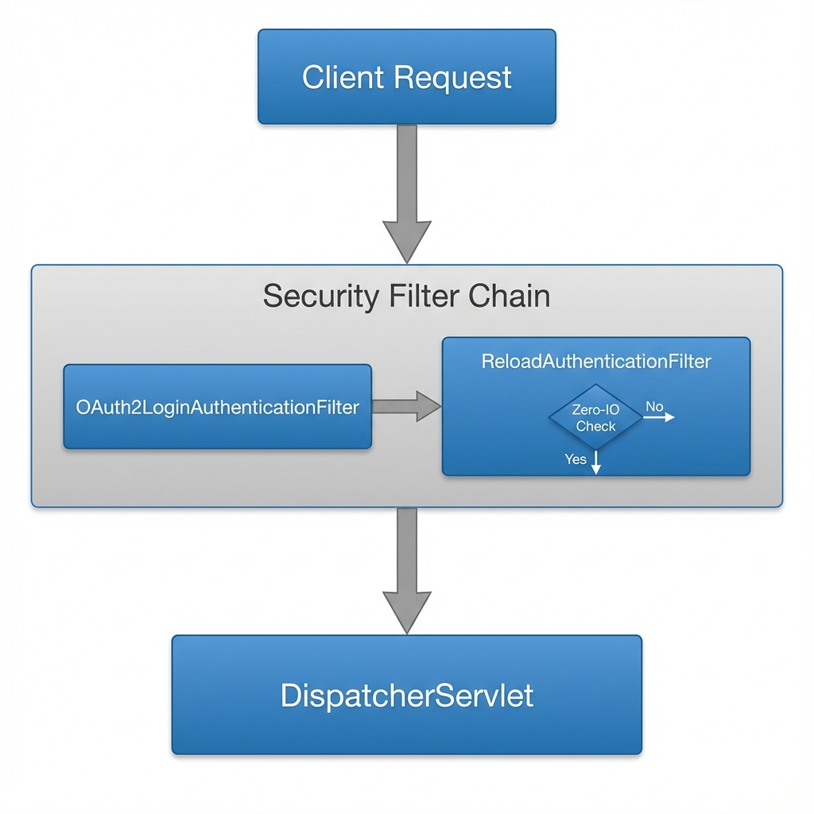

# 시스템 아키텍처 (System Architecture)

## 1. 기술 스택 (Tech Stack)
| 구분 | 기술 | 버전 | 비고 |
| :--- | :--- | :--- | :--- |
| **Language** | Java | 17 | LTS |
| **Framework** | Spring Boot | 3.5.7 | |
| **Build** | Gradle | Kotlin DSL | |
| **DB** | MySQL, MongoDB, Redis (Valkey) | 8.4.7 / 8.2.2 / 8.1.4 |  |
| **Infra** | AWS SES | - | 메일 발송 (External Service) |

## 2. 패키지 구조 (Package Structure)
**도메인형(Domain-Driven) 구조**를 채택하여 기능별 응집도를 높였습니다.

```text
kr.ac.koreatech.sw.kosp
├── domain                  # [핵심 비즈니스 로직]
│   ├── admin               # 관리자 (신고, 공지, 접근제어)
│   ├── auth                # 인증 (Login, Logout, Token)
│   ├── challenge           # 챌린지 (Tier, Challenge)
│   ├── community           # 커뮤니티 (Article, Comment, Board)
│   ├── github              # 깃허브 연동 (Repository, Commit)
│   ├── mail                # 메일 (Verification)
│   ├── report              # 신고 (User/Post Report)
│   └── user                # 사용자 (Signup, Profile, Activity)
├── global                  # [전역 공통 모듈]
│   ├── config              # 설정 (WebMvc, Swagger, Security)
│   ├── constants           # 상수 (ErrorMessage, Regex)
│   ├── converter           # 변환기 (JPA Converter)
│   ├── dto                 # 공통 DTO (ApiResponse, PageResponse)
│   ├── exception           # 에러 핸들링 (GlobalExceptionHandler)
│   ├── host                # 호스트 처리 (@ServerURL)
│   ├── init                # 초기화 (DataInitializer)
│   ├── model               # 공통 모델 (BaseEntity)
│   └── security            # 보안 유틸 (@AuthUser, UserPrincipal)
└── infra                   # [외부 시스템 연동]
    ├── email               # 메일 발송 구현체 (SesMailSender)
    └── github              # 깃허브 API 클라이언트
```

## 3. 계층형 아키텍처 (Layered Architecture)
데이터는 **API Interface -> Controller -> Service -> Repository** 방향으로 흐릅니다.



1.  **API Interface Layer (`*Api.java`)**
    *   **역할**: API 명세(Swagger)와 구현의 분리.
    *   `@Operation`, `@Tag` 등 **문서화 전용 어노테이션**만 작성하여 비즈니스 코드의 가독성을 높입니다.
    *   **[📡 API 설계 가이드 (API Guide)](../domains/api_guide.md)**
2.  **Presentation Layer (`*Controller.java`)**
    *   **역할**: 요청 매핑 및 유효성 검증.
    *   `@GetMapping`, `@Valid`, `@RequestBody` 등 **기능 동작에 필요한 어노테이션**은 이곳에 작성합니다.
    *   API Interface를 구현(`implements`)하여 비즈니스 로직(Service)으로 위임합니다.
3.  **Business Layer (`*Service.java`)**
    *   **역할**: 핵심 비즈니스 로직 및 트랜잭션 관리.
    *   `@Transactional` 범위 내에서 데이터 일관성 보장.
4.  **Data Access Layer (`*Repository.java`)**
    *   **역할**: 데이터베이스 접근 추상화.
    *   JPA 및 Redis Repository 사용.
    *   **[☁️ 인프라 및 환경 (Infra & Config)](infra.md)**

## 4. 상세 시스템 흐름도 (Detailed System Flow)

### 4.1. 인증 및 보안 흐름 (Authentication & Security Flow)
클라이언트 요청 시 가장 먼저 수행되는 **Security Filter Chain**의 상세 동작입니다.
**Zero-IO 세션 검증**을 통해 매 요청마다 DB 조회를 방지하여 성능을 최적화했습니다.

> [!NOTE]
> 상세 아키텍처 다이어그램 이미지를 아래 경로에 추가해주세요.
> `docs/wiki/imgs/auth_security_flow.png`



### 4.2. 일반 애플리케이션 흐름 (General Application Flow)
인증이 완료된 요청이 **Web MVC 설정**을 거쳐 **비즈니스 로직**으로 이어지는 흐름입니다.

> [!NOTE]
> 일반 요청 처리 흐름 다이어그램 이미지를 아래 경로에 추가해주세요.
> `docs/wiki/imgs/general_app_flow.png`


### 🧩 주요 컴포넌트 상세 (Key Components logic)
1.  **Security Filter Chain**:
    *   `ReloadAuthenticationFilter`: 세션의 사용자 정보를 **Zero-IO** 방식(로컬 캐시)으로 검증하고 필요 시 DB에서 최신화합니다.
2.  **Web Interceptors**:
    *   `ServerURLInterceptor`: 요청 경로(Host)를 파싱하여 전역 `ServerURLContext`에 저장합니다.
3.  **Argument Resolvers**:
    *   `@AuthUser`: SecurityContext에서 현재 로그인한 유저 정보를 주입합니다.
    *   `@ServerURL`: 현재 서버의 Base URL을 주입합니다.
4.  **AOP & Annotations**:
    *   `@Valid`: DTO 필드 검증 수행.
    *   `@Transactional`: 서비스 계층의 트랜잭션 원자성 보장.

### 🧩 주요 컴포넌트 상세 (Key Components logic)
1.  **Security Filter Chain**:
    *   `ReloadAuthenticationFilter`: 세션의 사용자 정보를 **Zero-IO** 방식(로컬 캐시)으로 검증하고 필요 시 DB에서 최신화합니다.
2.  **Web Interceptors**:
    *   `ServerURLInterceptor`: 요청 경로(Host)를 파싱하여 전역 `ServerURLContext`에 저장합니다.
3.  **Argument Resolvers**:
    *   `@AuthUser`: SecurityContext에서 현재 로그인한 유저 정보를 주입합니다.
    *   `@ServerURL`: 현재 서버의 Base URL을 주입합니다.
4.  **AOP & Annotations**:
    *   `@Valid`: DTO 필드 검증 수행.
    *   `@Transactional`: 서비스 계층의 트랜잭션 원자성 보장.
