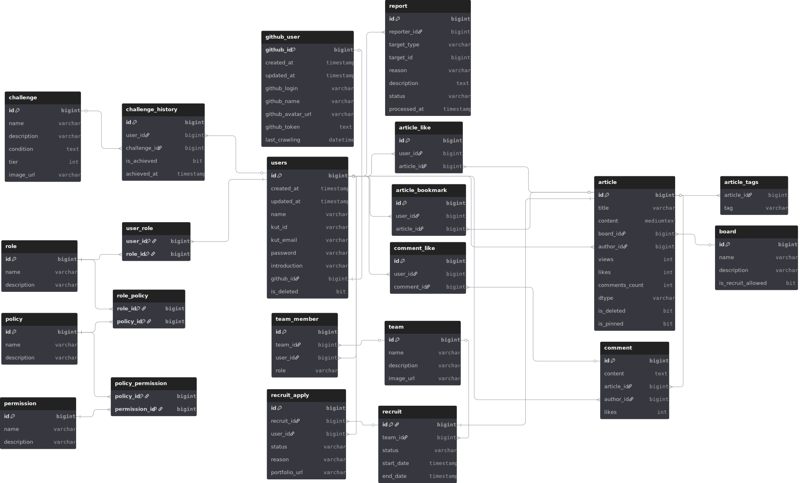
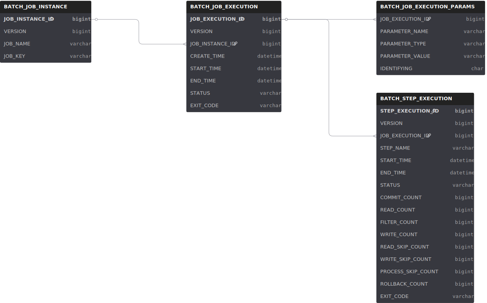

# 💾 데이터베이스 스키마 (Database Schema)
프로젝트의 데이터베이스는 RDBMS(MySQL)와 NoSQL(MongoDB)을 혼용하는구조입니다.
ERD 관리는 **[dbdiagram.io](https://dbdiagram.io/)**를 권장합니다.

## 1. ERD

### MySQL - Main Schema
[](https://dbdiagram.io/d/6953276e39fa3db27bc581d4)

**[🔗 [Main Schema] 인터랙티브 ERD 보기 (View Interactive Diagram)](https://dbdiagram.io/d/6953276e39fa3db27bc581d4)**

### MySQL - Batch Schema
[](https://dbdiagram.io/d/69532e1539fa3db27bc5c2e8)

**[🔗 [Batch Schema] 인터랙티브 ERD 보기 (View Interactive Diagram)](https://dbdiagram.io/d/6953276e39fa3db27bc581d4)**

---

## 2. 상세 스키마 (Detailed Schema)

### 2.1. MySQL - Main Schema (`kosp`)
비즈니스 로직을 담당하는 메인 RDBMS입니다.

<details>
<summary>📂 <strong>Click to view DBML Code (kosp)</strong></summary>

```dbml
// ==========================================
// 1. MySQL - Main Schema (kosp)
// ==========================================
Table users {
  id bigint [pk, increment]
  created_at timestamp
  updated_at timestamp
  name varchar
  kut_id varchar [unique, note: '교내 학번']
  kut_email varchar [unique, note: '교내 이메일']
  password varchar
  introduction varchar
  github_id bigint [ref: - github_user.github_id]
  is_deleted bit
}

Table github_user {
  github_id bigint [pk]
  created_at timestamp
  updated_at timestamp
  github_login varchar
  github_name varchar
  github_avatar_url varchar
  github_token text
  last_crawling datetime
}

Table role {
  id bigint [pk, increment]
  name varchar [unique]
  description varchar
}

Table policy {
  id bigint [pk, increment]
  name varchar [unique]
  description varchar
}

Table permission {
  id bigint [pk, increment]
  name varchar [unique]
  description varchar
}

Table user_role {
  user_id bigint [pk, ref: > users.id]
  role_id bigint [pk, ref: > role.id]
}

Table role_policy {
  role_id bigint [pk, ref: > role.id]
  policy_id bigint [pk, ref: > policy.id]
}

Table policy_permission {
  policy_id bigint [pk, ref: > policy.id]
  permission_id bigint [pk, ref: > permission.id]
}

Table board {
  id bigint [pk, increment]
  name varchar
  description varchar
  is_recruit_allowed bit
}

Table article {
  id bigint [pk, increment]
  title varchar
  content mediumtext
  board_id bigint [ref: > board.id]
  author_id bigint [ref: > users.id]
  views int
  likes int
  comments_count int
  dtype varchar
  is_deleted bit
  is_pinned bit
}

Table article_tags {
  article_id bigint [ref: > article.id]
  tag varchar
}

Table comment {
  id bigint [pk, increment]
  content text
  article_id bigint [ref: > article.id]
  author_id bigint [ref: > users.id]
  likes int
}

Table article_like {
  id bigint [pk, increment]
  user_id bigint [ref: > users.id]
  article_id bigint [ref: > article.id]
}

Table article_bookmark {
  id bigint [pk, increment]
  user_id bigint [ref: > users.id]
  article_id bigint [ref: > article.id]
}

Table comment_like {
  id bigint [pk, increment]
  user_id bigint [ref: > users.id]
  comment_id bigint [ref: > comment.id]
}

Table team {
  id bigint [pk, increment]
  name varchar
  description varchar
  image_url varchar
}

Table team_member {
  id bigint [pk, increment]
  team_id bigint [ref: > team.id]
  user_id bigint [ref: > users.id]
  role varchar
}

Table recruit {
  id bigint [pk, ref: - article.id]
  team_id bigint [ref: > team.id]
  status varchar
  start_date timestamp
  end_date timestamp
}

Table recruit_apply {
  id bigint [pk, increment]
  recruit_id bigint [ref: > recruit.id]
  user_id bigint [ref: > users.id]
  status varchar
  reason varchar
  portfolio_url varchar
}

Table challenge {
  id bigint [pk, increment]
  name varchar
  description varchar
  condition text
  tier int
  image_url varchar
}

Table challenge_history {
  id bigint [pk, increment]
  user_id bigint [ref: > users.id]
  challenge_id bigint [ref: > challenge.id]
  is_achieved bit
  achieved_at timestamp
}

Table report {
  id bigint [pk, increment]
  reporter_id bigint [ref: > users.id]
  target_type varchar
  target_id bigint
  reason varchar
  description text
  status varchar
  processed_at timestamp
}
```
</details>

### 2.2. MySQL - Batch Schema (`kosp_batch`)
Spring Batch 메타데이터를 저장하는 별도 스키마입니다.

<details>
<summary>📂 <strong>Click to view DBML Code (kosp_batch)</strong></summary>

```dbml
// ==========================================
// 2. MySQL - Batch Schema (kosp_batch)
// ==========================================
Table BATCH_JOB_INSTANCE {
  JOB_INSTANCE_ID bigint [pk]
  VERSION bigint
  JOB_NAME varchar
  JOB_KEY varchar [unique]
}

Table BATCH_JOB_EXECUTION {
  JOB_EXECUTION_ID bigint [pk]
  VERSION bigint
  JOB_INSTANCE_ID bigint [ref: > BATCH_JOB_INSTANCE.JOB_INSTANCE_ID]
  CREATE_TIME datetime
  START_TIME datetime
  END_TIME datetime
  STATUS varchar
  EXIT_CODE varchar
}

Table BATCH_JOB_EXECUTION_PARAMS {
  JOB_EXECUTION_ID bigint [ref: > BATCH_JOB_EXECUTION.JOB_EXECUTION_ID]
  PARAMETER_NAME varchar
  PARAMETER_TYPE varchar
  PARAMETER_VALUE varchar
  IDENTIFYING char
}

Table BATCH_STEP_EXECUTION {
  STEP_EXECUTION_ID bigint [pk]
  VERSION bigint
  JOB_EXECUTION_ID bigint [ref: > BATCH_JOB_EXECUTION.JOB_EXECUTION_ID]
  STEP_NAME varchar
  START_TIME datetime
  END_TIME datetime
  STATUS varchar
  COMMIT_COUNT bigint
  READ_COUNT bigint
  FILTER_COUNT bigint
  WRITE_COUNT bigint
  READ_SKIP_COUNT bigint
  WRITE_SKIP_COUNT bigint
  PROCESS_SKIP_COUNT bigint
  ROLLBACK_COUNT bigint
  EXIT_CODE varchar
}
```
</details>

### 2.3. MongoDB - Document Store (`kosp`)
Github 크롤링 데이터와 같이 **비정형/반정형 데이터**를 저장합니다.
Table이 아닌 **Collection(JSON Documents)** 형태로 관리됩니다.

#### `github_profiles`
사용자의 상세 GitHub 프로필 정보와 분석 결과입니다.

```json
{
  "_id": "ObjectId",
  "githubId": 12345678,         // MySQL github_user 테이블과 연관
  "username": "octocat",
  "bio": "Coding machine",
  "tier": 5,                    // 계산된 티어
  "followers": 150,
  "following": 50,
  "score": 4500.5,              // 기여도 점수
  "languageStats": {
    "Java": 500000,
    "Python": 300000
  },
  "analysis": {
    "workingStyle": "Night Owl",
    "collaborationStyle": "Independent",
    "bestRepository": {
      "name": "algo-101",
      "totalCommits": 500
    }
  }
}
```

#### `github_repositories`
사용자가 소유한 리포지토리의 상세 메타데이터입니다.

```json
{
  "_id": "repo_full_name",
  "ownerId": 12345678,          // github_profiles 참조
  "name": "awesome-project",
  "url": "https://github.com/...",
  "primaryLanguage": "Java",
  "languages": {
    "Java": 90,
    "Shell": 10
  },
  "stats": {
    "diskUsage": 10240,
    "stargazersCount": 55,
    "forksCount": 12
  },
  "dates": {
    "createdAt": "2024-01-01T00:00:00",
    "pushedAt": "2024-12-30T10:00:00"
  }
}
```

#### `github_trends`
일별/월별 활동 내역입니다.

```json
{
  "_id": "12345678_2024-12",     // Compound Key (ID + Period)
  "githubId": 12345678,
  "period": "2024-12",
  "commits": 45,
  "pullRequests": 12,
  "issues": 3,
  "starsEarned": 5
}
```
