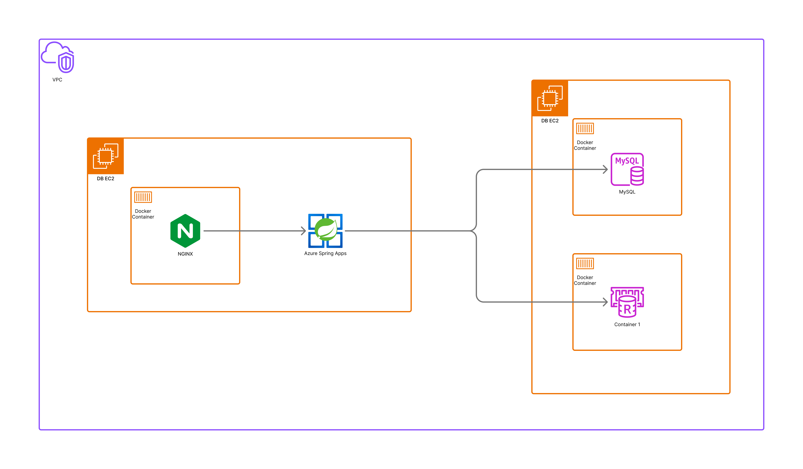

# ☁️ 인프라 아키텍처 (Infrastructure Architecture)

시스템의 물리적 논리적 구성과 클라우드 리소스 배치도입니다.
AWS 클라우드 환경 내 VPC(Virtual Private Cloud)를 구성하여 보안성과 관리 효율성을 확보했습니다.

## 1. 🏗️ 전체 시스템 토폴로지 (System Topology)

애플리케이션 서버(WAS)와 데이터베이스 서버(DB)를 물리적으로 분리한 **2-Tier Architecture**입니다.

## 2. 🌍 서버 구성 요소 (Component Details)

### 🖥️ 애플리케이션 서버 (WAS Server)
*   **리소스**: AWS EC2 (Linux)
*   **Nginx**: Reverse Proxy, 80/443 Port.
*   **Spring Boot 3**: API Server, Docker Container, 8080 Port.

### 💾 데이터 서버 (DB Server)
데이터의 안정성과 리소스 격리를 위해 별도의 EC2 인스턴스로 분리했습니다.
*   **리소스**: AWS EC2 (Linux)
*   **MySQL 8.0**
*   **Redis**
*   **MongoDB**

## 3. ☁️ 외부 연동 서비스 (External Services)
*   **AWS SES** (Simple Email Service)
