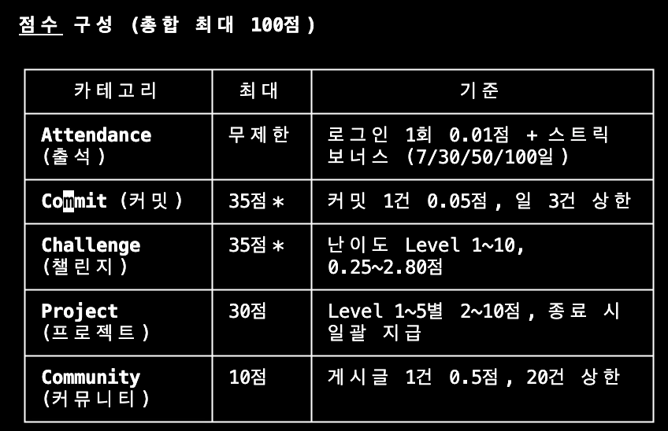
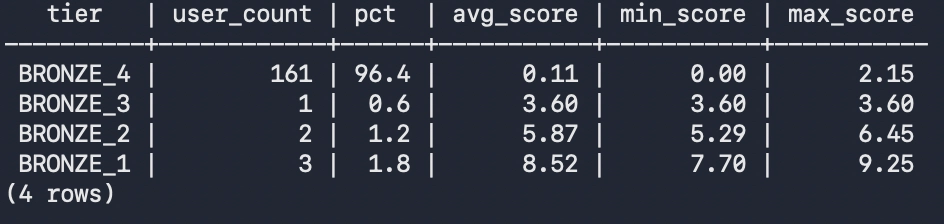
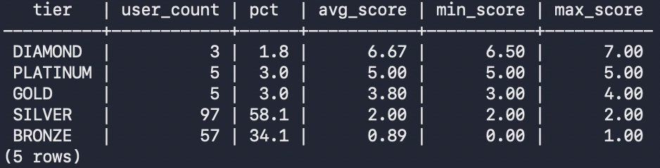

## 랭킹 시스템

### 현재 배포 현황

점수 체계가 출석 0.01점/일, 커밋 0.05점/회로 너무 낮게 설계되어,
시즌 내내 출석만 해도 1.2점 → 전 유저 Bronze 집중.

### 개선 방향 — 상대평가 + 절대점수 혼합

| 티어 | 기준 |
| --- | --- |
| Bronze ~ Platinum | 상대평가 (활성 유저 분포 기준) |
| Diamond 이상 | 상위 % + 절대점수 조건 모두 충족 |

> **점수는 상위 티어 해금 조건, 상대순위는 실제 진입 조건**

### 수정 후 예상 분포

| 티어 | 목표 비율 | 해당 유저 |
| --- | --- | --- |
| Bronze | 25% | 거의 활동 없음 |
| Silver | 25% | 간헐적 출석·커밋 |
| Gold | 25% | 주 3회 이상 커밋 |
| Platinum | 13% | 꾸준한 커밋 + 커뮤니티 |
| Diamond 이상 | 최대 12% | 점수 30점 이상 + 상위 순위 |

### 상위 티어 등장 시점 (2026-2학기 기준)

- **Silver ~ Platinum:** 시즌 시작 즉시 (상대평가로 자동 분포)
- **Diamond (30점):** 시즌 시작 약 2~3개월 후
- **Master (42점):** 시즌 중반 (3~4개월)
- **Challenger (55점):** 시즌 약 60일차 전후

### 기타 운영

- 점수 반영: 매일 새벽 4시 배치 / 티어 재배정: 주 1회
- Diamond 이상 강등: 7일 유예
- 신규 유저: 14~30일 Provisional (미랭크) 처리
- 시즌 종료 후: 최종 티어 기준 1~2단계 하향 소프트 리셋

---

1. 시즌랭킹(기존)

1. 전체랭킹

---

## 조직(Organization) 단위 기능

GitHub Organization을 K-OSP에 등록하면 멤버·레포를 자동으로 수집·관리하는 기능.
수업/팀 GitHub 조직을 서비스에 연결해 구성원 활동 추적에 활용한다.

**시나리오 흐름**

1. GitHub admin 권한이 있는 사용자가 K-OSP에서 자신의 조직을 선택해 등록
2. 등록 즉시 조직 멤버 전체를 GitHub API로 수집 → K-OSP 가입 여부에 따라 상태 분류
   - `LINKED`: 이미 K-OSP 가입 완료
   - `EMAIL_PENDING`: 미가입, 공개 이메일로 가입 안내 메일 자동 발송
   - `EMAIL_PRIVATE`: 미가입 + 이메일 비공개 (발송 불가)
3. 조직 레포지토리도 동시에 수집 (커밋 수집 대상 관리)
4. 관리자(교직원)는 관리자 페이지에서 조직 목록 조회, 멤버/레포 확인, 수동 재동기화, 조직 비활성화 가능

---

## GitHub 크롤링 구조 개선

| # | 항목 | 내용 |
|---|------|------|
| 1 | timeout 단축 | 기존 5분 → 30~60초로 단축, 특정 요청이 전체 작업을 오래 붙잡는 문제 완화 |
| 2 | timeout 재시도 추가 | ReadTimeoutException 등을 재시도 대상에 포함 → 일시적 API 지연 시 작업 실패 감소 |
| 3 | 실패 레포 skip | 특정 레포 수집 실패 시 전체 중단 없이 건너뛰고 이후 재수집 가능하도록 개선 |
| 4 | 재개 구조 개선 | 배치 중단 시 처음부터 재시작하지 않고 실패 구간부터 재개 |
| 5 | Worker 수평 확장 | 기존 RabbitMQ 큐 그대로 Worker 서버 추가 시 자동 병렬 처리 → 이용자 증가에 유연하게 대응 |

### Worker 확장 효과 및 비용

현재 구조는 Docker Compose 기반으로 Harvester(크롤링 Worker) 1대가 RabbitMQ 큐에서 작업을 순차 처리한다.

**확장 효과**

| 구성 | 예상 처리량 | 비고 |
|------|-----------|------|
| Worker 1대 (현재) | 기준 | - |
| Worker 2대 | 약 2배 | 큐에서 서로 다른 작업을 동시에 처리 |
| Worker 3대 | 약 3배 | 이용자 300~500명 수준까지 지연 없이 대응 가능 |

RabbitMQ Work Queue 패턴 특성상 Worker 수에 거의 비례하여 처리량이 증가한다. 코드 변경 없이 서버만 추가하면 된다.

**비용 (서버 1대 추가 기준)**

| 클라우드 | 사양 | 월 비용 |
|---------|------|--------|
| NHN Cloud | m2.c2m4 (2vCPU / 4GB) | 약 3~4만원 |
| AWS 서울 | t3.medium (2vCPU / 4GB) | 약 4~5만원 |

> Harvester는 API 서버가 아닌 배치 처리 전용이므로 최소 2vCPU / 4GB 수준으로도 충분히 운영 가능하다.
